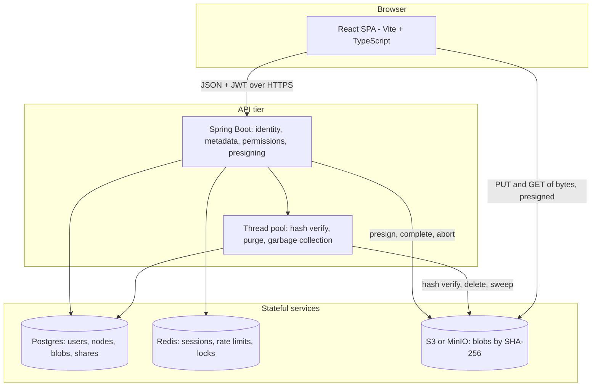
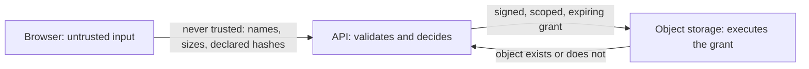
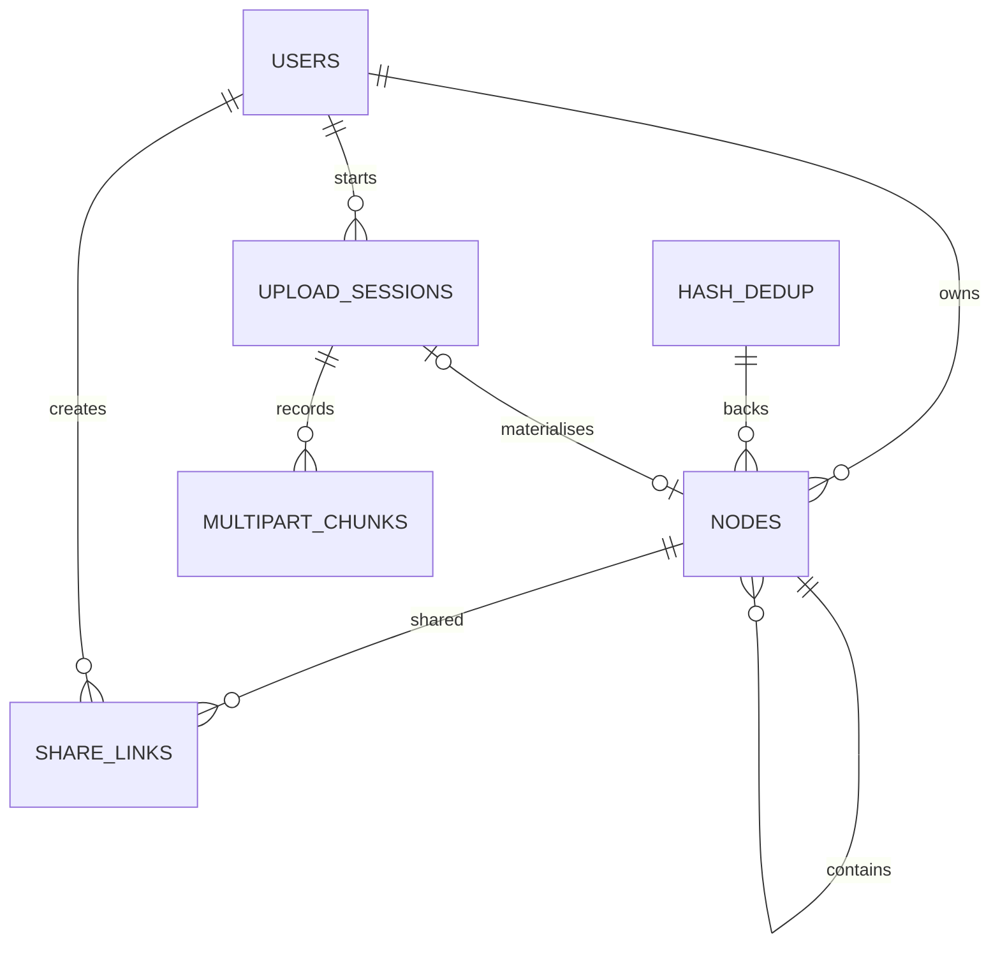
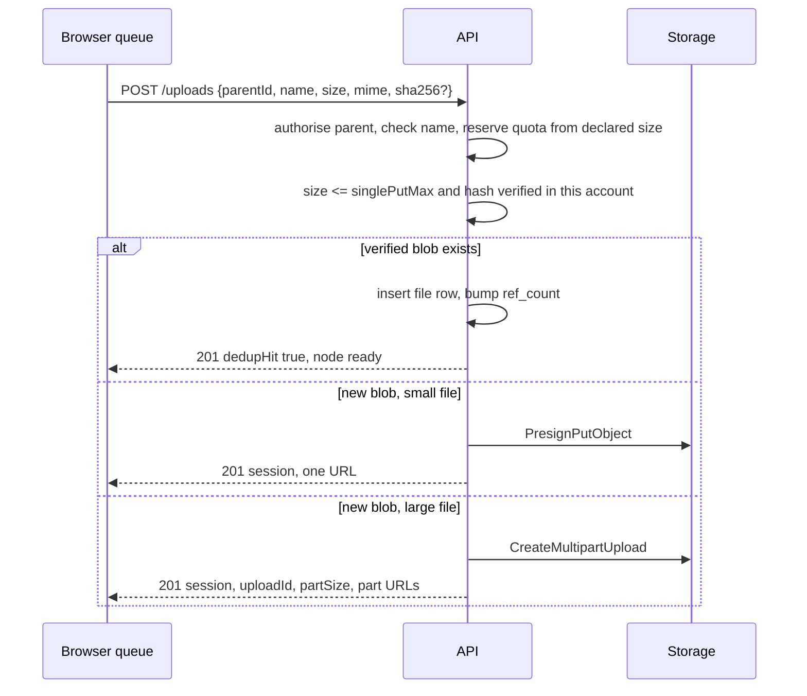
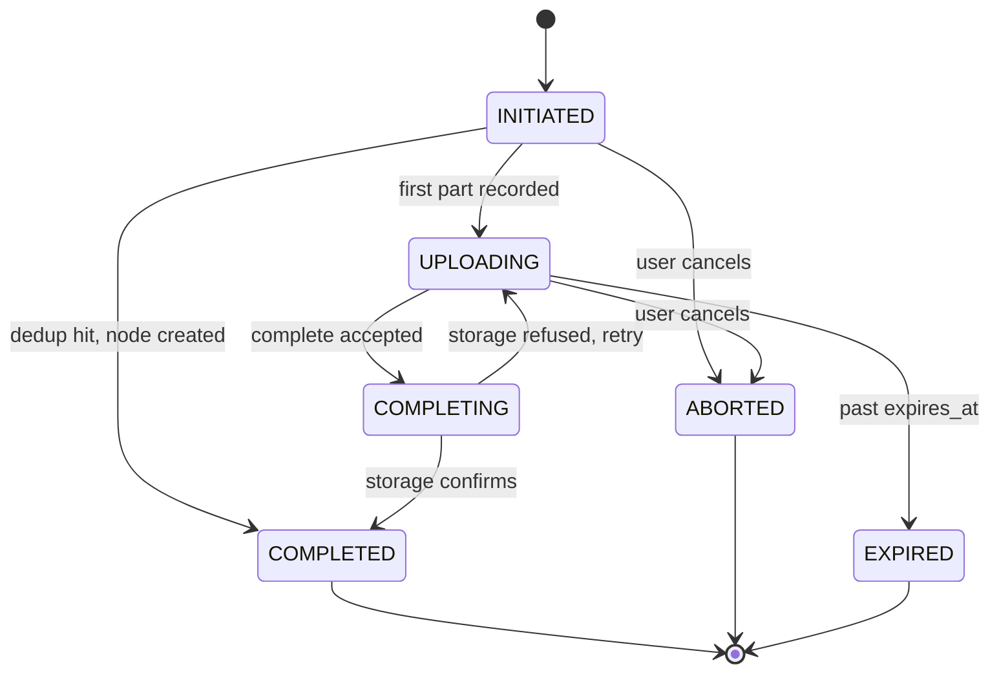
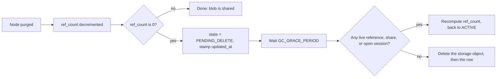

# ExoDrive — Project Map

The single source of truth for what ExoDrive is, what it must do, how it is put
together, and what has to be true before each piece counts as done. Read it top
to bottom for orientation; jump to a numbered part for detail.

**Status legend used throughout**

| Tag | Meaning |
| --- | --- |
| `[rep]` | Exists in the repo today as real implementation. |
| `[stub]` | Exists in the repo as an empty file, a placeholder, or demo text. |
| `[plan]` | Does not exist yet. Defined here as the agreed target. |
| `[gap]` | A concrete defect or missing artifact found while writing this map. |

> [!IMPORTANT]
> Everything described below is a **target**, not a description of current code.
> The repository today holds directory structure and file names only — see
> [Part 2](#part-2--current-state-audit) for exactly what is real.

---

## Table of contents

1. [Product definition](#part-1--product-definition)
2. [Current state audit](#part-2--current-state-audit)
3. [System architecture](#part-3--system-architecture)
4. [Data model](#part-4--data-model)
5. [API contract](#part-5--api-contract)
6. [Core flows](#part-6--core-flows)
7. [Functional requirements](#part-7--functional-requirements)
8. [Non-functional requirements](#part-8--non-functional-requirements)
9. [Edge cases and failure matrix](#part-9--edge-cases-and-failure-matrix)
10. [Security and abuse](#part-10--security-and-abuse)
11. [Frontend map](#part-11--frontend-map)
12. [Infrastructure and local development](#part-12--infrastructure-and-local-development)
13. [Testing strategy](#part-13--testing-strategy)
14. [Delivery plan](#part-14--delivery-plan)
15. [Open decisions](#part-15--open-decisions)
16. [Appendix A — configuration defaults](#appendix-a--configuration-defaults)
17. [Appendix B — naming and conventions](#appendix-b--naming-and-conventions)
18. [Appendix C — build order](#appendix-c--build-order)

---

## Part 1 — Product definition

### One sentence

ExoDrive is a virtual file system: a Dropbox-style product where a user's
folders and files live in a browser UI, the bytes live in S3-compatible object
storage, and the service in the middle owns only metadata, identity,
permissions, and the short-lived credentials clients use to move bytes directly
to and from storage.

### The word "virtual" carries the design

| Property | Consequence for the build |
| --- | --- |
| No file ever lands on the API server's disk | The API is stateless and horizontally scalable; byte throughput never competes with metadata queries. |
| The database is the truth about the tree | Listing, rename, move, and delete are metadata transactions, not object-store operations. |
| Object storage is content-addressed by the service | Deduplication, garbage collection, and integrity checks become possible without storing duplicate bytes. |
| Access is granted by signed, expiring URLs | Permissions must be enforced at presign time; a leaked URL is a time-boxed grant. |
| A node's identity is a database id, never a path | Moves and renames are cheap and share links survive them — but no user-supplied string may ever be interpolated into a storage key. |

### Jobs to be done

1. **Get files in.** Drag a folder of photos in, walk away, come back to it
   finished — including after closing the tab mid-upload.
2. **Get files out.** List, download, or copy a link a colleague can open
   without an account.
3. **Find things again.** Navigate a tree, search by name, recognise file types
   at a glance, sort a long folder.
4. **Organise without fear.** Rename, move, duplicate, and delete knowing delete
   is reversible and mistakes are recoverable for a retention window.
5. **Trust the numbers.** See how much storage is used, and get a clear refusal
   when a quota is hit rather than a silent failure.

### Scope

**In scope for v1**

- Email and password accounts, JWT access and refresh tokens.
- One tree per user: folders and files nested to a depth limit.
- Chunked, resumable, parallel uploads straight to object storage.
- Content-addressed deduplication within an account.
- Download via presigned GET, with the correct filename on the saved file.
- Trash: soft delete, list, restore, purge, and retention-based automatic purge.
- Public share links for a file or folder: revocable, optionally expiring.
- Folder listing with pagination, sort, and name search.
- Per-user storage quota accounting.
- Grid and list views, breadcrumb navigation, context menu operations.

**Deliberately out of scope for v1** (listed so they are decisions, not oversights)

- Desktop sync client and local/remote conflict resolution.
- Real-time collaboration, comments, version history UI.
- Cross-tenant or global deduplication (see [D5](#d5--deduplication-scope)).
- Client-side end-to-end encryption, zero-knowledge storage.
- Content search, OCR, media transcoding, document preview rendering.
- Mobile native apps, offline PWA mode.
- Team/organisation accounts, roles, admin console.
- Billing integration (quota tiers are static configuration in v1).

### Users and primary scenarios

The product is single-player in v1: one account owns its tree. The only
multi-party path is a share link.

| Scenario | Shape of the flow |
| --- | --- |
| First run | Register, land on an empty Dashboard, create a folder, upload one file, see it listed and downloadable. |
| Bulk ingest | Drop 200 files from a folder drag; the queue shows per-file progress, failures are retryable per file, the tab can be closed and reopened. |
| Large file | Upload a 20 GB video; it is sliced into parts, a few parts in flight, progress is byte-accurate, a flaky network pauses instead of restarting. |
| Retrieval | Navigate three levels deep, sort by modified date, download a file, copy a share link for another. |
| Housekeeping | Delete a folder by mistake, find it in Trash, restore it, verify its children came back with it. |
| Ceiling | Hit the quota mid-queue; the UI explains which files were rejected and why, and the rest continue. |

---

## Part 2 — Current state audit

### What is actually real today

| Path | State |
| --- | --- |
| `README.md` | `[stub]` — the single line `# ExoDrive`. |
| `test-guide.md` | `[stub]` — demo text. |
| `docker-compose.yml` | `[stub]` — empty file. |
| `.env.example` (root) | `[stub]` — empty file. |
| `.gitignore` | `[stub]` — empty file. |
| `apps/backend/**` | `[stub]` — 50 files, all 0 bytes, except `VfsApplication.java`, which holds demo text. Java package is `com.vfs.backend`. |
| `apps/frontend/**` | `[stub]` — 40 source files, all 0 bytes, except `src/main.tsx`, which holds demo text. `node_modules/` is installed but untracked. |

No runnable build exists in either app: `apps/frontend/package.json` is empty and
`apps/backend/pom.xml` is empty, so neither app can install, compile, or start.

### The scaffold is the architecture

Even empty, the file names commit the project to a stack. Those are treated as
decisions already made, and the rest of this map builds on them.

| Layer | Committed to | Evidence in the scaffold |
| --- | --- | --- |
| Backend runtime | Java + Spring Boot, Maven | `VfsApplication.java`, `pom.xml`, `config/SecurityConfig.java`, `dto/*` |
| Metadata store | Postgres with Flyway migrations | `resources/db/migration/V1..V4__*.sql` |
| Ephemeral state | Redis | `config/RedisConfig.java` |
| Object storage | S3-compatible (`S3Client`, `S3Presigner`), MinIO locally | `config/S3Client.java`, `service/storage/StorageService.java` |
| Auth | Spring Security + JWT filter + user details service | `security/JWTFilter.java`, `security/AuthEntryPoint.java`, `security/UserDetailsService.java` |
| Byte transfer | Presigned URLs driven from the browser over XHR | `hooks/usePresignedGet.ts`, `hooks/useXHRPut.ts` |
| Dedup | SHA-256 content addressing with a reference table | `util/SHA256StreamHasher.java`, `repository/HashDedupRepository.java` |
| Multipart upload | S3 multipart with chunk bookkeeping | `model/S3MultipartChunk.java`, `repository/ChunkRepository.java`, `service/multipart/MultipartService.java` |
| Async work | Server-side thread pool for post-upload and maintenance jobs | `config/ThreadPoolConfig.java` |
| Frontend | React + TypeScript + Vite, Tailwind config present | `main.tsx`, `vite.config.ts`, `tailwind.config.js` |
| Frontend transport | Axios wrapper around the API | `services/axios.ts`, `services/vfs.ts` |
| Frontend state | One store module holding client state | `store/{useStore.ts}` |

### Findings

| # | Finding | Impact | Recommended fix |
| --- | --- | --- | --- |
| `[gap]` F1 | `apps/frontend/src/store/{useStore.ts}` is a file literally named `{useStore.ts}` inside `src/store/`. | The store never resolves at import time, so nothing depending on client state can compile. | Rename to `src/store/useStore.ts`; confirm the intended state library and add it to `package.json`. |
| `[gap]` F2 | `package.json`, `pom.xml`, `vite.config.ts`, `tsconfig.json`, `tailwind.config.js`, both Dockerfiles, `docker-compose.yml`, `.env.example`, and `.gitignore` are all empty. | Neither app can build, install, run, or be containerised. | Fill these first — they are [M0](#part-14--delivery-plan). |
| `[gap]` F3 | Frontend dependencies are absent from `node_modules`: `react-router-dom`, `axios`, `zustand`, `tailwindcss`, `autoprefixer`, `clsx`, an icon set, and any test runner. Only `react`, `react-dom`, `vite`, `typescript`, `eslint`, and `zod` are installed. | Every file importing one of these fails, and `tailwind.config.js` cannot work without `tailwindcss`. | Declare every dependency in `package.json` before implementing screens. |
| `[gap]` F4 | Migration order is `V1__init_schema`, `V2__users`, so the node schema precedes the table its foreign keys need. | Migrations cannot run in order. | Reorder to `V1__users`, `V2__nodes`, `V3__dedup_table`, `V4__multipart_chunks`. |
| `[gap]` F5 | `repository/FolderNodeRepository.java` has no matching entity — `model/` has `TreeNode`, `FileMetadata`, `User`, `S3MultipartChunk` but no folder entity. | The folder half of the tree has no persistence type. | Add `model/FolderNode.java`, or make `TreeNode` the concrete entity for folders and document that choice. |
| `[gap]` F6 | No share capability anywhere on the backend while `pages/Shared.tsx` exists and depends on it. | The Shared page cannot be built. | Add `model/ShareLink.java`, `repository/ShareLinkRepository.java`, `service/share/ShareService.java`, `controller/ShareController.java`, plus DTOs. |
| `[gap]` F7 | No route table and no router dependency, and the page set lacks a public share landing page and an account/settings page. | Share links have nowhere to open; quota usage has nowhere to display. | Add routes `/login`, `/`, `/folder/:nodeId`, `/trash`, `/shared`, `/settings`, `/s/:token`. |
| `[gap]` F8 | `util/ByteConverter.java` and `utils/fileSizeFormatter.ts` both exist with no shared contract on whether sizes are bytes or human strings. | Off-by-1024 bugs and inconsistent quota messages. | Rule: the API transports integers of bytes only; human formatting happens in the client. |
| `[gap]` F9 | `README.md`, `test-guide.md`, and `main.tsx` contain demo text. | Placeholder content can be mistaken for working code. | Replace as each milestone lands; keep no demo text in tracked source. |

---

## Part 3 — System architecture

### Components

### Trust boundaries

Rules that follow from these boundaries:

1. The client never sends a path, only a `parentId`. The server builds storage
   keys from ids and hashes, so traversal and injection are structurally
   impossible ([`S3KeyGenerator`](#appendix-b--naming-and-conventions)).
2. A declared SHA-256 is a **hint** until the server has verified that object
   once for that account. Dedup may only be trusted against a verified hash.
3. Presigned URLs are bearer credentials. Their lifetime is the only thing that
   limits damage if one leaks, so it stays short.
4. Object storage is not a database: it cannot enforce ownership, quotas, or
   naming rules. Every such check happens in the API before a URL is issued.

### Why bytes bypass the API

| Alternative | Why it loses |
| --- | --- |
| Proxy all bytes through Spring Boot | Every upload occupies a request thread and the heap; throughput, memory, and timeouts become the bottleneck, and one slow client can starve metadata traffic. |
| Client holds long-lived storage credentials | The browser would need write access to the whole bucket; one XSS or leaked bundle key exposes every account's data. |
| Server-side download then stream to client | Doubles egress cost, doubles latency, and makes range requests and resumable downloads the server's problem. |

Presigned, scoped, short-lived URLs remove all three costs. The API's job is to
answer "may this principal, right now, move this blob to or from this location"
and then get out of the way.

### Backend layering and where each file sits

| Layer | Files in the scaffold | Responsibility |
| --- | --- | --- |
| Entry point | `VfsApplication.java` | Boot, configuration binding, scheduled job registration. |
| Config | `config/SecurityConfig`, `CORSConfig`, `S3Client`, `S3Presigner`, `RedisConfig`, `ThreadPoolConfig` | Beans and cross-cutting policy. Split S3 client (server-side ops) from presigner (what clients get) so presign keys can be narrower than server keys. |
| Security | `security/JWTFilter`, `AuthEntryPoint`, `UserDetailsService` | Stateless authentication on every request; JSON 401 problem responses at the entry point rather than an HTML redirect. |
| Controllers | `controller/Auth`, `Folder`, `File`, `Upload`, `Download` | HTTP shape only: bind, validate, delegate, map to status codes. No business rules. |
| Services | `service/auth`, `tree`, `storage`, `presign`, `multipart`, `dedup`, `trash` | All rules live here, one service per concern, each with a single reason to change. |
| Repositories | `repository/User`, `FileNode`, `FolderNode`, `HashDedup`, `Chunk` | Persistence queries. Ownership filters belong in every query, not in a caller's `if`. |
| Models | `model/User`, `TreeNode`, `FileMetadata`, `S3MultipartChunk` | Entities and value types. |
| DTOs | `dto/AuthRequest`, `AuthTokenResponse`, `CreateFolderRequest`, `InitUploadRequest`, `CompleteUploadRequest`, `PresignResponse`, `NodeResponse`, `TreeResponse` | Public contract. Entities are never serialised directly. |
| Errors | `exception/VfsException`, `FileNotFoundException`, `FolderNotEmptyException`, `S3OperationException`, `GlobalExceptionHandler` | One exception tree, one place that turns it into an HTTP response. |
| Utilities | `util/S3KeyGenerator`, `SHA256StreamHasher`, `ByteConverter` | Pure functions, heavily unit tested, no I/O except the hasher's stream. |

### Service ownership boundaries

| Service | Owns | Must not |
| --- | --- | --- |
| `AuthService` | Registration, login, token issue and rotation, logout, password policy. | Know about files or storage. |
| `TreeService` | Node CRUD, listing, breadcrumb, search, rename, move, copy, cycle checks, name conflicts. | Talk to S3. |
| `StorageService` | Object existence, size and ETag reads, server-side delete, multipart create/complete/abort, list parts. | Know about ownership or naming. |
| `PresignService` | Turning an authorised intent into URLs, TTL policy, part splitting. | Persist node metadata. |
| `MultipartService` | Upload session lifecycle, part bookkeeping, resume state, completion transaction. | Compute content hashes. |
| `DedupService` | Hash records, verification state, reference counting, sweep eligibility. | Serve HTTP or presign. |
| `TrashService` | Soft delete, subtree marking, restore, purge, retention. | Delete blobs directly; it marks them and hands off to GC. |

---

## Part 4 — Data model

### Tables and the scaffold files that name them

| Table | Entity / DTO | Repository | Migration | State |
| --- | --- | --- | --- | --- |
| `users` | `model/User` | `repository/UserRepository` | `V1__users.sql` | `[plan]` (file named `V2__users.sql` today) |
| `nodes` | `model/TreeNode` + `model/FileMetadata` + `model/FolderNode` | `repository/FileNodeRepository`, `repository/FolderNodeRepository` | `V2__nodes.sql` | `[plan]` (file named `V1__init_schema.sql` today) |
| `hash_dedup` | `model/BlobRef` | `repository/HashDedupRepository` | `V3__dedup_table.sql` | `[plan]` |
| `upload_sessions` | `model/UploadSession` | `repository/UploadSessionRepository` | `V4__multipart_chunks.sql` | `[plan]`, missing from scaffold |
| `multipart_chunks` | `model/S3MultipartChunk` | `repository/ChunkRepository` | `V4__multipart_chunks.sql` | `[plan]` |
| `share_links` | `model/ShareLink` | `repository/ShareLinkRepository` | `V5__share_links.sql` | `[plan]`, missing from scaffold ([F6](#part-2--current-state-audit)) |

### Relationship sketch

### Decision D3 — one `nodes` table, not two

`FileNodeRepository` and `FolderNodeRepository` both exist in the scaffold. They
can be two repositories over **one** `nodes` table, and that is the recommended
shape:

| Concern | One `nodes` table with a `kind` discriminator | Separate `file_nodes` and `folder_nodes` tables |
| --- | --- | --- |
| Sibling name uniqueness | One partial unique index covers files and folders together | A name could exist as both a file and a folder; needs a trigger or a third table to prevent it |
| Listing a folder | One indexed query, one ORDER BY, keyset pagination works | UNION of two tables, then sort and paginate in the database or in memory |
| Recursive tree walk | One recursive CTE covers the whole tree | CTE must UNION two tables at every level |
| Move, copy, trash a subtree | Uniform operation on one table | Duplicated logic per table, plus cross-table moves |
| Cost | File-only columns (`blob_id`, `size_bytes`) are NULL on folder rows | No NULL columns |

Three NULL columns per folder is a small price for one coherent rule about what
a node is. The cost is contained with CHECK constraints so a folder can never
take on file state.

The two repositories stay, documented as query facades over `nodes`
(`kind = 'FILE'`, `kind = 'FOLDER'`), so the scaffold layout is preserved.

### `nodes`

| Column | Type | Notes |
| --- | --- | --- |
| `id` | UUID, primary key | UUIDv7, so inserts stay index-friendly and ids sort by creation time. |
| `owner_id` | UUID, not null, FK `users(id)` | Denormalised onto every row so every query can filter ownership in the index, with no upward walk. |
| `parent_id` | UUID, null, FK `nodes(id)` | NULL means the node sits at the account root. |
| `kind` | text, not null | `FILE` or `FOLDER`. |
| `name` | text, not null | Stored NFC-normalised; original case preserved for display. |
| `size_bytes` | bigint, not null | 0 for folders ([F8](#part-2--current-state-audit)). |
| `mime_type` | text, null | Sniffed server-side at completion, never trusted from the browser for security decisions. |
| `blob_id` | UUID, null, FK `hash_dedup(id)` | NULL for folders. |
| `depth` | integer, not null | Root children are depth 1; maintained on insert and move so `MAX_DEPTH` is an O(1) check. |
| `version` | integer, not null, default 1 | Incremented on every mutation; the optimistic-concurrency token. |
| `created_at`, `updated_at` | timestamptz, not null | `updated_at` is what sort-by-modified uses. |
| `deleted_at` | timestamptz, null | Soft-delete marker. NULL means live. |
| `trash_root_id` | UUID, null | The subtree root that was trashed; every descendant carries the same value so a restore is one indexed update. |
| `original_parent_id` | UUID, null | Where the trashed subtree came from, used by restore. |

Constraints and indexes:

| Name | Definition | Purpose |
| --- | --- | --- |
| `nodes_sibling_name_live_uniq` | UNIQUE (`owner_id`, `parent_id`, lower(`name`)) WHERE `deleted_at` IS NULL | Sibling names are unique, case-insensitively, among live rows only — so a name freed by a delete is immediately reusable. |
| `nodes_folder_listing_idx` | (`owner_id`, `parent_id`, `name`) WHERE `deleted_at` IS NULL | Keyset pagination for folder listings. |
| `nodes_recent_idx` | (`owner_id`, `updated_at` DESC) WHERE `deleted_at` IS NULL | Recent-files view and sort by modified. |
| `nodes_trash_idx` | (`owner_id`, `deleted_at` DESC) WHERE `deleted_at` IS NOT NULL | Trash listing. |
| `nodes_trash_group_idx` | (`trash_root_id`) WHERE `deleted_at` IS NOT NULL | Group restore and purge. |
| `nodes_blob_idx` | (`blob_id`) WHERE `blob_id` IS NOT NULL | Reference counting and GC eligibility. |
| `nodes_search_idx` | GIN `pg_trgm` on `name` WHERE `deleted_at` IS NULL | Substring name search. Swap for a `lower(name) text_pattern_ops` btree if only prefix search is needed. |
| `nodes_file_state_ck` | CHECK: `kind = 'FILE'` implies `blob_id IS NOT NULL`; `kind = 'FOLDER'` implies `blob_id IS NULL AND size_bytes = 0` | Makes the kind a real constraint, not a convention. |
| `nodes_depth_ck` | CHECK `depth >= 0 AND depth <= 64` | Enforces the depth ceiling at the database too. |

### `hash_dedup` (the blob table)

| Column | Type | Notes |
| --- | --- | --- |
| `id` | UUID, primary key | Referenced by `nodes.blob_id`. |
| `sha256` | char(64), not null | Hex digest. |
| `owner_id` | UUID, not null, FK `users(id)` | Dedup scope, per [D5](#d5--deduplication-scope). |
| `size_bytes` | bigint, not null | Verified object size. |
| `storage_key` | text, not null | Derived only from the digest — see [Appendix B](#appendix-b--naming-and-conventions). |
| `state` | text, not null | `PENDING`, `ACTIVE`, or `PENDING_DELETE`. |
| `verified_at` | timestamptz, null | Set once the server has hashed the stored object itself. Only verified rows may trigger a dedup skip. |
| `ref_count` | integer, not null, default 0 | CHECK `ref_count >= 0`; the GC sweep trigger. |
| `created_at` | timestamptz, not null | |

| Name | Definition | Purpose |
| --- | --- | --- |
| `hash_dedup_scope_uniq` | UNIQUE (`owner_id`, `sha256`) | One blob row per account per digest. Global scope later means dropping `owner_id` from this index and adding a `scope` column, not rewriting queries. |
| `hash_dedup_gc_idx` | (`state`, `updated_at`) WHERE `ref_count` = 0 | Finds sweep candidates without scanning live rows. |

### `upload_sessions` and `multipart_chunks`

The scaffold names `V4__multipart_chunks.sql`, `model/S3MultipartChunk`, and
`repository/ChunkRepository`. Chunk rows alone are not enough: the session needs
durable state so a resume survives an API restart, and so an abandoned session
can be aborted and swept.

| `upload_sessions` column | Type | Notes |
| --- | --- | --- |
| `id` | UUID, primary key | The `sessionId` the client resumes with. |
| `owner_id` | UUID, not null, FK `users(id)` | Ownership check on every session operation. |
| `parent_id` | UUID, not null, FK `nodes(id)` | Target folder, resolved and authorised at init. |
| `name`, `size_bytes`, `mime_type` | as declared | `size_bytes` is the reserved quota amount until completion reconciles it. |
| `declared_sha256` | char(64), null | Untrusted hint until verified. |
| `upload_id` | text, null | S3 multipart upload id; NULL for single-PUT uploads. |
| `storage_key` | text, not null | Where the parts land; identical to the final blob key, so completion is not a copy. |
| `part_size_bytes` | bigint, not null | Computed once at init and returned to the client so every client agrees. |
| `status` | text, not null | `INITIATED`, `UPLOADING`, `COMPLETING`, `COMPLETED`, `ABORTED`, `EXPIRED`. |
| `dedup_hit` | boolean, not null | True when init short-circuited and no bytes were sent. |
| `node_id` | UUID, null, unique, FK `nodes(id)` | Set exactly once at completion — the idempotency anchor. |
| `created_at`, `updated_at`, `expires_at` | timestamptz | `expires_at` drives the abort of abandoned sessions. |

| `multipart_chunks` column | Type | Notes |
| --- | --- | --- |
| `id` | UUID, primary key | |
| `session_id` | UUID, not null, FK `upload_sessions(id)` ON DELETE CASCADE | |
| `part_number` | integer, not null | 1-based, at most `MAX_PARTS`; UNIQUE (`session_id`, `part_number`) makes completion idempotent per part. |
| `size_bytes` | bigint, not null | Verified against the declared part size except for the final part. |
| `etag` | text, not null | Returned by storage on part upload; required by `CompleteMultipartUpload`. |
| `uploaded_at` | timestamptz, not null | |

Two rules govern this pair of tables:

1. **Authoritative part state is `ListParts`, not these rows.** `multipart_chunks`
   is the client-reported record, used for progress reporting and size validation;
   completion reconciles it against what storage actually holds
   ([D7](#d7--who-owns-part-state)).
2. **A live session holds its name.** A partial unique index on `upload_sessions`
   over (`owner_id`, `parent_id`, lower(`name`)) limited to rows in `INITIATED` or
   `UPLOADING` makes two parallel inits for the same name impossible
   ([E11](#91-upload-boundaries)), and completion, abort, or expiry releases it.

### `share_links` `[plan]`

| Column | Type | Notes |
| --- | --- | --- |
| `id` | UUID, primary key | |
| `token` | text, not null, unique | 32 random bytes, base64url. The only credential; never derived from the node id. |
| `owner_id` | UUID, not null, FK `users(id)` | |
| `node_id` | UUID, not null, FK `nodes(id)` | File or folder. |
| `permission` | text, not null | `VIEW` (list and metadata) or `DOWNLOAD` (also fetch bytes). |
| `password_hash` | text, null | Optional gate, hashed with the same scheme as account passwords. |
| `expires_at` | timestamptz, null | NULL means no expiry. |
| `max_downloads`, `download_count` | integer, null / not null | Enforced with an atomic increment, not read-then-write. |
| `revoked_at` | timestamptz, null | Revocation is immediate and checked on every public request. |
| `created_at`, `last_accessed_at` | timestamptz | |

A share link resolves permissions **at request time** by joining to the live node,
so revoking a link, trashing the node, or purging it all take effect at once
without touching blob state.

### `users`

| Column | Type | Notes |
| --- | --- | --- |
| `id` | UUID, primary key | |
| `email` | citext or text with a unique index on `lower(email)` | Login identity. |
| `password_hash` | text, not null | BCrypt or Argon2id. Never reversible, never logged. |
| `quota_bytes` | bigint, not null | Plan ceiling. |
| `used_bytes` | bigint, not null, default 0 | Denormalised counter, updated atomically, reconciled by a nightly job. |
| `display_name` | text, null | |
| `status` | text, not null | `ACTIVE`, `SUSPENDED`, `PENDING_DELETE`. |
| `created_at`, `updated_at`, `last_login_at` | timestamptz | |

### Invariants

These are the rules a reviewer can check any flow against. Each one has a test
in [Part 13](#part-13--testing-strategy).

1. `owner_id` of a node equals the `owner_id` of its parent.
2. The `parent_id` chain is acyclic and no row exceeds `MAX_DEPTH`.
3. A `FILE` row always has `blob_id` and a real size; a `FOLDER` row never has `blob_id` and always has size 0.
4. Two live siblings never share a name, compared case-insensitively.
5. `ref_count` equals the number of live file rows referencing the blob, up to nightly reconciliation.
6. The sum of live file sizes for an account never exceeds `quota_bytes`, and `used_bytes` equals that sum up to nightly reconciliation.
7. A trashed subtree is trashed as a group: every descendant shares `trash_root_id`, and restore restores the group to `original_parent_id` when it still exists.
8. `storage_key` is a pure function of the digest and contains no user input.
9. No bytes leave storage to a client without an authorisation check in the same request that issued the URL.
10. Completion is idempotent: replaying `complete` for a session returns the same node, never a second one.

---

## Part 5 — API contract

### Conventions

| Concern | Rule |
| --- | --- |
| Base path | `/api/v1`. Versioned from the first release so the SPA and API can move independently. |
| Auth | `Authorization: Bearer <access-token>` on everything except `/api/v1/auth/*` and `/api/v1/public/*`. |
| Ids | UUIDv7 as strings. |
| Sizes | Integers of bytes, always. Never formatted strings ([F8](#part-2--current-state-audit)). |
| Timestamps | ISO-8601 UTC with offset. |
| Errors | `application/problem+json` (RFC 7807) carrying an extra stable `code`. Never a bare Spring error body. |
| Pagination | Opaque `cursor` plus `limit` (default 100, max 1000); response carries `nextCursor`. Offsets are rejected because rows move. |
| Concurrency | Mutations accept an optional `If-Match: <version>`. Absent means last-write-wins; present and stale means 409. |
| Idempotency | `complete` and `abort` are idempotent by `sessionId`; `POST /nodes/{id}/copy` accepts an `Idempotency-Key` header to stop double copies on retry. |

### Endpoints

**Auth** — `controller/AuthController`, `service/auth/AuthService`

| Method | Path | Request | Response | Notes |
| --- | --- | --- | --- | --- |
| POST | `/auth/register` | `AuthRequest` | `AuthTokenResponse` | Rejects duplicate email; password policy enforced server-side. |
| POST | `/auth/login` | `AuthRequest` | `AuthTokenResponse` | Rate limited per account and per IP. |
| POST | `/auth/refresh` | refresh token | `AuthTokenResponse` | Rotates the refresh token; the old one is burned. |
| POST | `/auth/logout` | refresh token | 204 | Adds the refresh token to a Redis denylist until natural expiry. |
| GET | `/auth/me` | — | `UserResponse` | Identity plus quota and usage. |

**Tree and nodes** — `controller/FolderController`, `controller/FileController`, `service/tree/TreeService`

| Method | Path | Request | Response | Notes |
| --- | --- | --- | --- | --- |
| GET | `/nodes` | `?parentId&cursor&limit&sort&order&kind&q` | `TreeResponse` | One call returns the children, the breadcrumb, and the cursor. `parentId` omitted means root. |
| GET | `/nodes/{id}` | — | `NodeResponse` | Metadata for one node, including its breadcrumb. |
| POST | `/folders` | `CreateFolderRequest` | 201 `NodeResponse` | Creates one folder; `parentId` must be owned and live. |
| POST | `/folders/tree` | `CreateFolderTreeRequest` | 201 `TreeResponse` | Bulk path creation for a dropped folder; idempotent per path. |
| PATCH | `/nodes/{id}` | `UpdateNodeRequest` (`name` and/or `parentId`) | `NodeResponse` | Rename, move, or both. Cycle check and name-conflict check in one transaction. |
| POST | `/nodes/{id}/copy` | `CopyNodeRequest` (`parentId`, optional `name`) | 202 `NodeResponse` | Returns immediately; large subtrees copy asynchronously. Blobs are shared, not duplicated. |
| DELETE | `/nodes/{id}` | `?mode=trash` or `?mode=permanent`, `?recursive=true` or `false` | 204 | Default is trash. Permanent on a non-empty folder without `recursive=true` raises `FolderNotEmptyException`. |
| GET | `/nodes/{id}/download` | — | `PresignResponse` | `usePresignedGet` consumes this. Short TTL; filename carried in the URL's response headers. |
| GET | `/search` | `?q&cursor&limit` | `TreeResponse` | Name search across the account's live nodes. |
| GET | `/usage` | — | `UsageResponse` | Quota, used bytes, per-kind breakdown. Backs the settings page. |

**Upload** — `controller/UploadController`, `service/presign/PresignService`, `service/multipart/MultipartService`, `service/dedup/DedupService`

| Method | Path | Request | Response | Notes |
| --- | --- | --- | --- | --- |
| POST | `/uploads` | `InitUploadRequest` | 201 `InitUploadResponse` | Reserves quota, decides single PUT versus multipart, returns URLs. Returns `dedupHit: true` with a finished node when the blob is already verified in this account. |
| GET | `/uploads/{sessionId}` | — | `UploadSessionResponse` | Resume state: `partSize`, uploaded part numbers and ETags, `expiresAt`. |
| POST | `/uploads/{sessionId}/parts` | `PresignPartsRequest` (`partNumbers`) | `PresignResponse` | Refreshes URLs whose TTL lapsed without losing progress. |
| POST | `/uploads/{sessionId}/complete` | `CompleteUploadRequest` (`parts[]`) | 200 `NodeResponse` | Idempotent. Creates the node, sets the blob's state, reconciles quota. |
| POST | `/uploads/{sessionId}/abort` | — | 204 | Aborts the S3 upload, releases reserved quota, marks the session. |
| GET | `/uploads` | `?status=INITIATED` or `UPLOADING` | `UploadListResponse` | Lets the UI offer "resume these" after a reload on another device. |

**Download** — `controller/DownloadController`

| Method | Path | Notes |
| --- | --- | --- |
| GET | `/nodes/{id}/download` | Authorises, then returns a presigned GET URL with `response-content-disposition` set to the node's current name, so a rename is reflected and the saved filename is right. |

**Trash** — `service/trash/TrashService`

| Method | Path | Notes |
| --- | --- | --- |
| GET | `/trash` | Lists trashed subtree roots with `originalParentId` and days remaining. |
| POST | `/trash/{id}/restore` | Restores the whole group; if the original parent is gone, restores to root; on a name collision, restores as `name (restored)`. |
| DELETE | `/trash/{id}` | Purges one group now. |
| DELETE | `/trash` | Empties trash. Requires `?confirm=true`. |

**Sharing** — `[plan]`, see [F6](#part-2--current-state-audit)

| Method | Path | Auth | Notes |
| --- | --- | --- | --- |
| POST | `/shares` | yes | Creates a link for a node with optional expiry, password, and download cap. |
| GET | `/shares` | yes | Lists the account's links with access counts. |
| DELETE | `/shares/{id}` | yes | Revokes. Takes effect on the next public request. |
| GET | `/public/shares/{token}` | no | Metadata for the landing page; asks for a password when one is set. |
| GET | `/public/shares/{token}/content` | no | Presigned GET for a file, or a listing cursor for a folder. |

### DTO inventory

| Endpoint family | Existing DTO in scaffold | DTOs that must be added `[plan]` |
| --- | --- | --- |
| Auth | `AuthRequest`, `AuthTokenResponse` | `UserResponse`, `RefreshRequest` |
| Tree | `CreateFolderRequest`, `NodeResponse`, `TreeResponse` | `UpdateNodeRequest`, `CopyNodeRequest`, `CreateFolderTreeRequest`, `BreadcrumbEntry` |
| Upload | `InitUploadRequest`, `CompleteUploadRequest`, `PresignResponse` | `InitUploadResponse`, `UploadSessionResponse`, `PresignPartsRequest`, `UploadListResponse`, `PartRef` |
| Download | — | reuse `PresignResponse` |
| Trash | — | `TrashEntryResponse` (or reuse `NodeResponse` plus trash fields) |
| Sharing | — | `CreateShareRequest`, `ShareLinkResponse`, `PublicShareResponse` |
| Usage | — | `UsageResponse` |
| Errors | — | `ProblemResponse` (`type`, `title`, `status`, `code`, `detail`, `instance`, `errors[]`) |

`PresignResponse` is deliberately reused for three jobs — upload parts, part
refresh, and download — because in all three cases the payload is a set of
scoped, expiring URLs plus their expiry. One shape keeps the client hook simple.

### Error taxonomy

One tree rooted at `VfsException`, mapped once in `GlobalExceptionHandler`.

| `code` | HTTP | Raised by | When |
| --- | --- | --- | --- |
| `INVALID_REQUEST` | 400 | validation | Malformed body, bad name, unknown sort field, bad cursor. |
| `UNAUTHENTICATED` | 401 | `AuthEntryPoint` | Missing, expired, or malformed access token. |
| `BAD_CREDENTIALS` | 401 | `AuthService` | Login or refresh failed. Identical message for unknown email and wrong password. |
| `FORBIDDEN` | 403 | ownership checks | Principal is authenticated but does not own the node or session. |
| `NOT_FOUND` | 404 | `FileNotFoundException` | Node, session, or share token does not exist or is not visible to this principal. |
| `NAME_CONFLICT` | 409 | `TreeService` | A live sibling already uses that name. Response includes a suggested alternative. |
| `FOLDER_NOT_EMPTY` | 409 | `FolderNotEmptyException` | Permanent delete or destructive move on a non-empty folder without `recursive=true`. |
| `NODE_CYCLE` | 409 | `TreeService` | Moving or copying a folder into itself or a descendant. |
| `VERSION_CONFLICT` | 409 | `TreeService` | `If-Match` version is stale. |
| `UPLOAD_INCOMPLETE` | 409 | `MultipartService` | `complete` called with missing or unverified parts. |
| `UPLOAD_EXPIRED` | 410 | `MultipartService` | Session passed `expires_at` or was aborted. |
| `QUOTA_EXCEEDED` | 409 | `AuthService` / `PresignService` | Reservation would exceed `quota_bytes`. Response lists the deficit so the UI can name the offending file. 507 is the alternative status; 409 keeps all client-recoverable conflicts on one code path. |
| `PAYLOAD_TOO_LARGE` | 413 | `PresignService` | Declared size exceeds the plan ceiling or `MAX_FILE_SIZE`. |
| `UNSUPPORTED_MEDIA_TYPE` | 415 | `PresignService` | MIME type fails the allow list. |
| `RATE_LIMITED` | 429 | filter backed by Redis | Includes `Retry-After`. |
| `SHARE_PASSWORD_REQUIRED` / `SHARE_EXPIRED` / `SHARE_REVOKED` | 401 / 410 / 410 | `ShareService` | Public share access gates. Distinct codes so the landing page can render the right state. |
| `STORAGE_UNAVAILABLE` | 502 | `S3OperationException` | Storage refused or timed out. Safe to retry; never leaks the storage error text. |
| `INTERNAL` | 500 | fallback | Anything uncaught. Logged with a request id, returned with that id only. |

Two rules keep this table honest: no controller throws an HTTP status directly,
and no exception message written for a log is returned to a client.

---

## Part 6 — Core flows

Each flow below is the specification the implementation has to match. The
component names are the scaffold files that own each step.

### 6.1 Account and session

1. `AuthController.register` validates the email and password policy, hashes with
   BCrypt, inserts the user with a default `quota_bytes`, and returns
   `AuthTokenResponse` (short-lived access token, long-lived rotating refresh token).
2. `JWTFilter` validates the access token per request and populates the security
   context. It never queries the database on the hot path beyond loading the user
   principal `UserDetailsService` needs.
3. Refresh rotates: the presented refresh token is invalidated as the new one is
   issued, so a replayed token fails. Logout writes the token to a Redis denylist
   with a TTL equal to its remaining life.
4. `AuthEntryPoint` returns the `UNAUTHENTICATED` problem response, never an HTML
   redirect, so the SPA can distinguish "log in again" from other failures.

### 6.2 Listing a folder

1. `TreeService.list(parentId, cursor, limit, sort, kind, q)` resolves `parentId`
   (NULL means root), asserts ownership in the same query, and reads one page of
   live children ordered by the requested key with the id as tiebreaker.
2. Folders sort before files when the primary key ties, matching every other file
   manager.
3. The response carries the page, the next cursor, and the breadcrumb, so the
   breadcrumb is never a second round trip.
4. `useFetchNodes` keeps the previous page mounted while the next loads, so
   scrolling a long folder never flashes an empty grid.

### 6.3 Upload — the initial decision

Consequences worth stating plainly:

- **Quota is reserved at init, not at completion.** Otherwise a user could queue
  fifty 10 GB files, pass the check fifty times, and only be stopped after the
  bytes exist.
- **A dedup skip never sends bytes.** It is allowed only when a hash is
  `verified_at` set for that account, which is what keeps a declared hash from
  being an oracle for another account's data ([D5](#d5--deduplication-scope)).
- **The declared size is a reservation, not a fact.** Completion reconciles
  `used_bytes` against the real object size.

### 6.4 Part sizing

| Input | Rule |
| --- | --- |
| `size <= SINGLE_PUT_MAX` | No multipart. One presigned PUT. S3's own 5 GiB single-PUT ceiling is the hard limit here. |
| `size > SINGLE_PUT_MAX` | `partSize = clamp(ceil(size / MAX_PARTS) rounded up to 1 MiB, MIN_PART_SIZE, MAX_PART_SIZE)` with `MIN_PART_SIZE = 5 MiB` (an S3 requirement for every part but the last). |
| Default | `SINGLE_PUT_MAX = 16 MiB`, `MAX_PARTS = 10000`, `MAX_PART_SIZE = 512 MiB`, so a 20 GB file becomes about 100 parts of 200 MiB and a 100 GB file stays under the 10 000-part ceiling. |
| Recorded once | `part_size_bytes` is written on the session and returned to every client, so a resumed upload from another device slices identically and already-uploaded parts still match. |
| The last part | May be smaller than `MIN_PART_SIZE`; it may also be 0 bytes only if the object is 0 bytes, which takes the single-PUT path instead. |

### 6.5 Upload session lifecycle

Every transition except `COMPLETED` releases the quota reservation. `EXPIRED` is
reached by the sweeper, which also issues `AbortMultipartUpload` so storage stops
billing for orphaned parts. A storage lifecycle rule is the belt-and-braces
second line of defence ([Appendix A](#appendix-a--configuration-defaults)).

### 6.6 Client-side upload mechanics

1. `Dropzone` accepts a drop or pick, including directory drops, and builds an
   `UploadTask` per file with a stable local id.
2. `Queue` limits concurrent files (default 3) and `useXHRPut` limits concurrent
   parts within a file (default 3). XHR, not `fetch`, because upload progress
   events are still the reliable way to drive `ProgressBar`.
3. Each task keeps its `sessionId`, `partSize`, and the set of completed parts in
   the store, and mirrors them to `localStorage` so a reload can resume.
4. Every part PUT is retried with exponential backoff plus jitter on network
   errors and 5xx, up to a cap, resuming from the first unfinished part.
5. A 403 from storage means the presigned URL expired, not that access was lost:
   the task calls `POST /uploads/{sessionId}/parts` to refresh and retries the
   same part.
6. Progress is byte-weighted across the whole file, so a mixed-size task queue
   shows honest overall progress rather than an average of percentages.
7. Pausing is local: the store stops scheduling parts, keeps the session, and
   resumes later. The server holds no pause state.

### 6.7 Completion

Storage operations first, then one database transaction that commits the result —
so a storage failure can never leave a half-created file:

1. Verify the session is owned, live, and in `UPLOADING` or `COMPLETING`.
2. Read the authoritative part list from storage (`ListParts`) and verify every
   part 1..N is present with the expected size; cross-check the client-supplied
   list against it, because that list is a hint, not the truth
   ([D7](#d7--who-owns-part-state)).
3. Call `CompleteMultipartUpload` with the ETags storage reported, ordered by part
   number.
4. Insert the `nodes` row, set `upload_sessions.node_id`, and set the blob's
   `state = ACTIVE`.
5. Reconcile quota: replace the reservation with the real size.
6. Enqueue background work: hash verification of the stored object, and the
   thumbnail or preview job if one is planned later.

Failure semantics: a duplicate `complete` finds `node_id` already set and returns
that node with 200 rather than creating a second file. A storage failure inside
step 3 leaves the session in `COMPLETING`, which is safe to retry and is also a
legitimate resume point.

### 6.8 Download

1. `DownloadController` authorises ownership of the node, refuses directories,
   and presigns a GET with a short TTL and
   `response-content-disposition: attachment; filename*=UTF-8''<encoded>` so the
   saved filename matches the current node name including non-ASCII characters.
2. `usePresignedGet` fetches that URL and hands the browser to it; the API never
   sees the bytes.
3. Range requests work because they are made directly against storage, which is
   what makes large media seekable without extra server work.
4. The TTL is minutes, not hours. A URL pasted into a chat is a grant that
   expires; a share link is the supported way to grant longer access.

### 6.9 Trash, restore, purge

1. `DELETE /nodes/{id}` marks the node and, in one recursive update, every live
   descendant with the same `deleted_at` and `trash_root_id`, recording
   `original_parent_id` on the root only.
2. Blobs are untouched at this point. A trashed file still costs its bytes, and
   `used_bytes` still counts them — matching the promise that trash is reversible
   for the retention window.
3. Restore reverses the group when `original_parent_id` still exists and is live;
   otherwise it restores to the root. A name collision resolves to
   `name (restored)`, never a failure.
4. Purge deletes the rows and lets GC reclaim blobs, so a purge during an active
   download cannot delete the object a live presigned URL is reading.
5. The nightly job purges groups whose `deleted_at` is older than
   `TRASH_RETENTION_DAYS`.

### 6.10 Garbage collection and dedup safety

The correctness question for GC is only this: is any live row, live share, or
in-flight session still pointing at the blob? So GC is a mark-and-sweep, never a
synchronous delete.

The grace window is what makes "re-upload the file the user just deleted" a dedup
hit rather than a race that deletes the object a client is still sending.

### 6.11 Sharing

1. Create: authorise the node, generate 32 random bytes, store the digest of the
   token, return the URL once. Optional password hashes with the account scheme;
   optional `expires_at` and `max_downloads`.
2. Resolve: `/public/shares/{token}` joins the link to the live node and checks
   revoked, expired, node deleted, and password in that order, returning distinct
   codes so the landing page can say which one failed.
3. Folder links list children through the same paginated listing logic, scoped to
   the shared subtree — a share never exposes a path outside its node.
4. Revoke: sets `revoked_at`. The next request fails. The token is not "rotated
   away", because the row is the check.
5. Download counting uses an atomic increment guarded by `max_downloads`, so two
   concurrent requests cannot both consume the last slot.

### 6.12 Rename, move, copy

| Operation | Checks in one transaction | Notes |
| --- | --- | --- |
| Rename | Ownership, live state, sibling name uniqueness, `If-Match` version | `updated_at` and `version` bump; blob and name are independent, so renames never touch storage. |
| Move | Ownership of both ends, target is a live folder, target is not a descendant of the node, depth ceiling for the deepest descendant, name uniqueness at the destination | Subtree depth is rewritten, which is why `depth` is a column rather than an expensive CTE on every check. |
| Copy | Ownership, destination shape, name uniqueness, blob sharing | Rows are duplicated and `ref_count` incremented per copy; no bytes move for a file copy, and a folder copy walks the subtree. Large copies return 202 and report progress through the session-style record rather than blocking a request thread. |

### 6.13 Quota accounting

| Moment | Action |
| --- | --- |
| Init | `used_bytes += declared size` inside the same transaction that creates the session; refusal happens before any URL is issued. |
| Complete | Replace the reservation with the real size; a large mismatch is logged as a client bug. |
| Abort, expire | Release the reservation. |
| Dedup hit | The reservation is kept: accounting is logical, so a dedup copy still consumes quota ([D6](#d6--what-counts-against-quota)). No bytes are transferred. |
| Trash | Nothing. Trashed bytes still count, and the UI says so. |
| Purge | `used_bytes -= size` for each row removed. |
| Nightly | Recompute `used_bytes` from live rows and correct drift; alert if drift exceeds a threshold, because that means an accounting path is broken. |

### 6.14 Search

`useDebounce` feeds `/search`, which matches live nodes by name within the
account using the trigram index, ordered by best match then `updated_at`. Results
carry breadcrumbs so a hit three levels down is actionable without a second call.
Search is scoped to the account, excludes trash by default, and is explicitly not
a path search in v1.

---

## Part 7 — Functional requirements

Requirement ids are stable and are what tests and review comments should cite.

### Authentication and account (backend `service/auth`, `security/*`; frontend `pages/Login.tsx`, `services/auth.ts`)

| Id | Requirement |
| --- | --- |
| FR-1 | A visitor can register with email and password and is signed in immediately. |
| FR-2 | Password policy is enforced server-side: minimum length, maximum length (BCrypt's 72-byte input limit is respected, not silently truncated), and rejection of the account's own email as password. |
| FR-3 | Login returns access and refresh tokens; the SPA stores the access token in memory and the refresh token in the least-exposed storage available, and attaches the access token to every API call through `services/axios.ts`. |
| FR-4 | A 401 from any call triggers exactly one refresh attempt, then a single retry of the original request; a second failure signs the user out and shows the login screen. |
| FR-5 | Logout invalidates the refresh token server-side, and the SPA clears all client state including the upload queue. |
| FR-6 | The account endpoint reports quota and usage, and the UI displays both. |

### Tree and navigation (backend `service/tree`, `controller/FolderController`, `controller/FileController`; frontend `components/explorer/*`, `components/layout/*`, `hooks/useFolderNav.ts`)

| Id | Requirement |
| --- | --- |
| FR-7 | Creating a folder is a single call, and the new folder appears in the listing without a full refetch. |
| FR-8 | Folder listings paginate with an opaque cursor; the UI loads more on scroll without duplicating or dropping rows. |
| FR-9 | Listings can be sorted by name, size, or modified time, ascending or descending, and folders sort before files on ties. |
| FR-10 | The breadcrumb always reflects the current folder and every ancestor is clickable. |
| FR-11 | The current folder is addressable by URL (`/folder/:nodeId`) and survives reload and browser back/forward. |
| FR-12 | `If-Match` conflicts surface as a clear "this changed elsewhere" message with a reload action, not a silent overwrite. |

### Upload (backend `service/presign`, `service/multipart`, `service/dedup`; frontend `components/upload/*`, `hooks/useXHRPut.ts`, `types/UploadTask.ts`, `types/UploadStatus.ts`)

| Id | Requirement |
| --- | --- |
| FR-13 | Files of any supported size up to the configured ceiling upload without proxying through the API. |
| FR-14 | Uploads are chunked with a server-decided part size, and several parts transfer concurrently. |
| FR-15 | Progress is byte-accurate per file and per queue. |
| FR-16 | An upload interrupted by network loss, tab close, or reload resumes from the last completed part without re-sending bytes. |
| FR-17 | Dropping a folder recreates its structure and uploads its contents, preserving relative paths. |
| FR-18 | A failing file does not fail its queue; each task is independently retryable and removable. |
| FR-19 | Duplicate folder drops, double-clicked submits, and retried calls never create duplicate files (idempotency at init and complete). |
| FR-20 | Uploading content the account already stores completes without transferring bytes, and the UI says so rather than appearing to lie about progress. |
| FR-21 | Quota refusal names the file and the deficit and never leaves a half-created node. |

### Download (backend `controller/DownloadController`; frontend `hooks/usePresignedGet.ts`)

| Id | Requirement |
| --- | --- |
| FR-22 | Any live file can be downloaded, including large files, with no server-side buffering. |
| FR-23 | The saved filename matches the node's current name, including non-ASCII and spaces. |
| FR-24 | Downloading a file the user does not own is impossible by any id substitution. |

### Trash (backend `service/trash`; frontend `pages/Trash.tsx`)

| Id | Requirement |
| --- | --- |
| FR-25 | Deleting a node moves it to trash without destroying anything, and the confirmation says what will happen to a folder's contents. |
| FR-26 | Trash lists trashed subtree roots with enough context (original location, size, time left) to decide. |
| FR-27 | Restore returns the whole subtree to a live parent, falling back to root when the original parent is gone. |
| FR-28 | Trashed groups purge automatically after the retention window, and the UI states that window. |
| FR-29 | Emptying trash requires an explicit confirmation and reports how much space it will actually free. |

### Sharing (backend `[plan]` `service/share`; frontend `pages/Shared.tsx`, `pages/PublicShare.tsx` `[plan]`)

| Id | Requirement |
| --- | --- |
| FR-30 | A file or folder can be shared by link with optional password, expiry, and download cap. |
| FR-31 | A recipient with no account can view or download per the link's permission and nothing beyond it. |
| FR-32 | A shared folder's listing is scoped to that subtree and cannot be walked upward. |
| FR-33 | Revoked, expired, and password-protected links each produce a distinct, honest page state. |
| FR-34 | The owner sees every active link with its access count and can revoke any of them. |

### Search, listing UI, settings

| Id | Requirement |
| --- | --- |
| FR-35 | Name search returns ranked results with breadcrumbs, debounced, cancelable, and safe against out-of-order responses. |
| FR-36 | Grid and list views are switchable, remembered per user, and both render file-type icons via `utils/extToIconMapper.ts` and human sizes via `utils/fileSizeFormatter.ts`. |
| FR-37 | The context menu offers open, download, rename, move, copy, share, details, and delete, with destructive items last and visually distinct. |
| FR-38 | Rename and move are available for both files and folders, with the same conflict handling. |
| FR-39 | Every async view has loading, empty, error, and (where relevant) partial-failure states; no view shows a blank screen on failure. |
| FR-40 | Every user-visible string comes from one catalog so the app can be translated without touching components. |

### Cross-cutting

| Id | Requirement |
| --- | --- |
| FR-41 | No endpoint returns another account's data for any id, cursor, token, session, or storage key, by construction and by test. |
| FR-42 | Destructive operations (permanent delete, empty trash, revoke link, move with overwrite) are confirmed and are recoverable or explicitly irreversible in the copy. |
| FR-43 | Every mutating endpoint is safe to retry: same input, same outcome, no duplicate side effects. |
| FR-44 | The API never puts a user-supplied string into a storage key, a SQL string, a log line without escaping, or an HTML response without escaping. |

---

## Part 8 — Non-functional requirements

### Performance

| Metric | Target |
| --- | --- |
| Metadata read (node, listing page of 100) | p95 under 150 ms, p99 under 400 ms at 1 000 concurrent API users. |
| Metadata write (create folder, rename, move) | p95 under 250 ms. |
| Presign (`init`, download, part refresh) | p95 under 100 ms excluding storage calls; `init` makes at most one storage call. |
| API calls per uploaded file | 3 (init, optional resume read, complete), independent of file size. |
| Listing a folder with 10 000 children | First page under 200 ms; no full scan, no in-memory sort. |
| Search across 1 000 000 nodes | p95 under 300 ms with the trigram index. |
| Client memory per upload task | Bounded by part size times concurrency, not by file size. |

### Scalability

- The API is stateless apart from Redis and Postgres, so instances scale horizontally with no session affinity.
- Byte throughput scales with storage, not with API capacity, so a 1 TB ingest day does not require more API replicas than a 1 GB one.
- The database is the only hard scaling limit, and every hot query is index-covered and ownership-filtered, which keeps sharding an option rather than a necessity.
- Upload sessions and chunks are the largest write volume, which is why part rows are inserted per part and cleaned by status, not kept forever.

### Reliability

| Concern | Requirement |
| --- | --- |
| Storage outage | Uploads and downloads fail with `STORAGE_UNAVAILABLE` and a retry affordance; metadata reads keep working. |
| Postgres outage | Fail fast with 503 and a request id; no partial writes, because multi-step operations are single transactions. |
| Redis outage | Degrade, do not break: rate limiting falls back to a conservative in-process limit, and refresh-token checks fall back to the database. Losing a lock must never lose data. |
| Process restart mid-upload | Sessions are durable in Postgres, so resume survives it. |
| Duplicate delivery | Completion and abort are idempotent; quota changes are atomic. |
| Data durability | Storage object versioning on; Postgres continuous archiving with point-in-time recovery; nightly logical backup. RPO under 5 minutes, RTO under 4 hours. |
| Integrity | Server-side hash verification marks blobs `verified_at`; a mismatch quarantines the blob (state set aside, node flagged, download refused) rather than serving corrupt bytes. |

### Observability

| Signal | Content |
| --- | --- |
| Logs | Structured JSON, one line per request, carrying request id, principal id, route, status, duration, and error code. Names and tokens are never logged. |
| Metrics | Request rate and latency by route; upload sessions opened, completed, aborted, expired; bytes in and out; dedup hit rate; GC bytes reclaimed; quota rejections; storage error rate. |
| Traces | One trace per upload spanning init, part PUTs, and complete, so a slow ingest is attributable to a part, a region, or the API. |
| Audit | Permanent record of destructive actions: permanent delete, empty trash, share create and revoke, login failures. |
| Alerts | Storage error rate, completion failure rate, GC backlog, quota-drift check failure, login-failure spikes. |

### Cost

- No bytes transit the API, so there is no egress amplification and no need for large API instances.
- A lifecycle rule aborts incomplete multipart uploads after the session TTL so abandoned parts never bill forever ([Appendix A](#appendix-a--configuration-defaults)).
- GC has a grace window but a finite one: PENDING_DELETE blobs are swept, not parked indefinitely.
- Dedup is the main lever on the storage bill, which is exactly why its scope and safety are spelled out in [D5](#d5--deduplication-scope).

### Usability and accessibility

- WCAG 2.1 AA: keyboard reachable menus, visible focus, correct roles on the tree and grid, `aria-live` on upload progress and toasts.
- Every destructive action is reachable by keyboard and reversible or explicitly confirmed.
- Motion-respect for progress animation; no layout shift when a transient error appears.
- Unicode honesty: names round-trip byte-for-byte through create, list, rename, download, and share. Combining characters, emoji, and RTL text are rendered, not mangled.
- Browsers: current Chrome, Firefox, Safari, and Edge. No legacy support, so no polyfill surface.

---

## Part 9 — Edge cases and failure matrix

This is the list a reviewer should be able to trace through the code. "Owner"
names the component that must handle the case; if a case has no owner, it is a
design hole.

### 9.1 Upload boundaries

| # | Case | Expected behaviour | Owner |
| --- | --- | --- | --- |
| E1 | 0-byte file | Valid. Single-PUT path with the empty-content digest. Never treated as a missing or failed upload. | `PresignService`, `DedupService` |
| E2 | 1-byte file | Single PUT, one part's worth of bookkeeping skipped entirely. | `PresignService` |
| E3 | Size exactly `SINGLE_PUT_MAX` | Single PUT. The boundary is inclusive. | `PresignService` |
| E4 | Size `SINGLE_PUT_MAX` + 1 | Multipart with `partSize` at least `MIN_PART_SIZE`, so the first part is legal. | `PresignService` |
| E5 | A middle part smaller than 5 MiB | Storage rejects the completion. The server must detect it from `ListParts` and return `UPLOAD_INCOMPLETE` naming the offending part, not surface a raw storage error. | `MultipartService` |
| E6 | Final part smaller than 5 MiB | Legal and expected. Only the last part is exempt. | `MultipartService` |
| E7 | Exactly `MAX_PARTS` parts | Accepted. | `PresignService` |
| E8 | Size that would need more than `MAX_PARTS` parts | Refused at init with the maximum acceptable size, because `partSize` is already at its ceiling. | `PresignService` |
| E9 | File above the plan ceiling | 413 `PAYLOAD_TOO_LARGE` at init, before any URL exists. | `PresignService` |
| E10 | Actual object size differs from the declared size | Rejected as a client bug: no node is created, the reservation is released, and the task is marked failed with the measured size shown. | `MultipartService` |
| E11 | Two parallel inits for the same name in the same folder | The second is refused with `NAME_CONFLICT`: an active session holds the name through a partial unique index on `upload_sessions`. | `MultipartService` |
| E12 | Abort, then immediately re-init the same name | Allowed. Aborting releases the name. | `MultipartService` |
| E13 | Unknown or forged MIME type | Sniffed server-side at completion; the stored type is the server's answer, and risky types are forced to download rather than render. | `StorageService`, `DownloadController` |

### 9.2 Interruption and resume

| # | Case | Expected behaviour | Owner |
| --- | --- | --- | --- |
| E14 | Network drops mid-part | Retry that part with backoff; progress already earned is never lost. | `useXHRPut` |
| E15 | Tab closed or browser killed mid-upload | Session is durable in Postgres; on return the task resumes from `ListParts`. | `MultipartService`, store |
| E16 | `localStorage` cleared, so the client forgot its session | `GET /uploads?status=UPLOADING` offers the session back, because the server is the source of truth. | `UploadController` |
| E17 | Presigned part URL expired (403 from storage) | Refresh the URLs for the remaining parts and retry. A 403 is a TTL signal, not an authorisation failure. | `useXHRPut`, `PresignService` |
| E18 | Access token expires mid-upload | One refresh and retry of API calls. In-flight part PUTs are unaffected because presigned URLs carry their own authorisation — do not abort them. | `services/axios.ts` |
| E19 | Refresh also fails mid-upload | Pause the queue, keep sessions, show sign-in. Resuming after login must not restart any file. | store, `Queue` |
| E20 | Session past `expires_at` | 410 `UPLOAD_EXPIRED`, quota released, storage parts swept, task marked "expired, re-upload". | `MultipartService`, sweeper |
| E21 | Browser lost the `complete` response | Retrying `complete` returns the already-created node. | `MultipartService` |
| E22 | Same file uploaded from two devices at once | Both sessions proceed; one creates the blob, the other dedups onto it at completion. | `DedupService` |
| E23 | Client clock is wrong | Expiry decisions always come from server-provided timestamps; refresh proactively at about 80% of TTL. | `useXHRPut`, `PresignService` |
| E24 | Storage is slow or timing out | Part retries absorb it; `init` and `complete` return `STORAGE_UNAVAILABLE` with retry semantics rather than hanging a request thread. | `StorageService`, `GlobalExceptionHandler` |

### 9.3 Naming and Unicode

| # | Case | Expected behaviour | Owner |
| --- | --- | --- | --- |
| E25 | Name contains `/` or `\` | 400. Slashes are structural here (parent is an id), so allowing them would create unaddressable nodes. | `TreeService` validation |
| E26 | Name is `.` or `..` | 400. | `TreeService` validation |
| E27 | Name is a Windows-reserved device name (`CON`, `NUL`, `AUX`, `PRN`, `COM1`) or ends with a dot or space | Rejected with a suggestion, because such names cannot be synced or downloaded on Windows. | `TreeService` validation |
| E28 | Name longer than 255 bytes | 400 stating the measured length in bytes, not characters. | `TreeService` validation |
| E29 | Name contains control characters or Unicode bidi overrides | 400. Bidi controls are a filename-spoofing vector, so they are rejected rather than stripped. | `TreeService` validation |
| E30 | Same visual name in NFC and NFD form | Stored NFC-normalised, so the pair collides and is refused. Otherwise two "identical" files exist and users cannot tell them apart. | `TreeService` |
| E31 | Case-only rename (`Report.pdf` to `report.pdf`) | Allowed. The uniqueness check must exclude the row being renamed, or the node collides with itself. | `TreeService` |
| E32 | Case-only collision with a different sibling | 409 `NAME_CONFLICT`. Uniqueness is case-insensitive. | `TreeService` |
| E33 | Duplicate name in the same folder | 409 with a suggested `name (2)`. | `TreeService` |
| E34 | Same name in a different folder, or after the original was trashed | Allowed. Uniqueness is per live sibling set. | `TreeService` |
| E35 | A file and a folder want the same name in one folder | 409: one namespace per folder, as in every real file system. | `TreeService` |
| E36 | Emoji, RTL, or combining-mark names | Round-trip byte-for-byte and render with ellipsis rather than being truncated in storage. | `TreeService`, `extToIconMapper` consumers |
| E37 | Name that collides only after NFC normalisation of a differently-encoded input | Same as E30; normalise before checking. | `TreeService` |

### 9.4 Tree operations

| # | Case | Expected behaviour | Owner |
| --- | --- | --- | --- |
| E38 | Move a folder into itself | 409 `NODE_CYCLE`. | `TreeService` |
| E39 | Move a folder into its own descendant | 409 `NODE_CYCLE`, detected by a depth-bounded descendant query before any write. | `TreeService` |
| E40 | Move into a folder that was trashed concurrently | 409 or 404 `NOT_FOUND`: the destination must be live at commit time, checked inside the transaction. | `TreeService` |
| E41 | Move that would push a descendant past `MAX_DEPTH` | 409 stating the resulting depth, computed from the subtree's own depth rather than by walking it. | `TreeService` |
| E42 | Move to the same parent it is already in | No-op 200 with the unchanged node; no version bump, so `If-Match` callers stay valid. | `TreeService` |
| E43 | Copy a folder into itself or a descendant | 409 `NODE_CYCLE`. | `TreeService` |
| E44 | Copy a folder containing an in-flight upload | The copy captures completed nodes only; the upload continues into the original. Documented as a point-in-time snapshot, not a partial file. | `TreeService` |
| E45 | Rename the same node from two tabs | `If-Match` makes the second call 409 `VERSION_CONFLICT`, which the UI resolves by reloading. | `TreeService` |
| E46 | Move and delete the same subtree concurrently | The transaction that commits first wins; the loser re-checks liveness and returns 404 or 409. Neither may leave an orphaned subtree. | `TreeService`, `TrashService` |
| E47 | Rename a file whose download URL is already issued | The in-flight URL keeps the old filename until it expires. Accepted: proxying downloads to fix this costs far more than it is worth. | `DownloadController` |
| E48 | Trash a folder that is the target parent of active upload sessions | The sessions are aborted, their reservations released, and the count reported. Otherwise files would appear in a trashed folder or vanish. | `TrashService`, `MultipartService` |
| E49 | Permanently delete a folder with active sessions | Refused with `FOLDER_NOT_EMPTY` until the sessions end or the user confirms recursive deletion, which aborts them. | `TrashService` |
| E50 | Create a folder deeper than `MAX_DEPTH` | 400 at create, before a row exists. | `TreeService` |
| E51 | Rename, move, or delete the account root | 400. The root has no name and no parent. | `TreeService` |
| E52 | Empty folder: trash, restore, rename, delete | All succeed; there is no special "empty" branch anywhere. | `TreeService` |

### 9.5 Trash and retention

| # | Case | Expected behaviour | Owner |
| --- | --- | --- | --- |
| E53 | Restore when the original parent is still live | Restores into it, whole group. | `TrashService` |
| E54 | Restore when the original parent is itself trashed or purged | Restores to the nearest live ancestor, falling back to the account root. | `TrashService` |
| E55 | Restore when a sibling now uses the name | Restores as `name (restored)`. Restore never fails on a name conflict. | `TrashService` |
| E56 | Delete an already-trashed node | Idempotent 204; trash is not a second state change. | `TrashService` |
| E57 | Trash a node whose ancestor is already trashed | 404: it is not visible, so it is not addressable. | `TrashService` |
| E58 | Purge while a share link points into the group | The link resolves to a gone state (`SHARE_EXPIRED`), never a partial folder listing. | `ShareService` |
| E59 | Purge while a download URL is in flight | GC's grace window keeps the object readable until that URL expires. Accepted, and the reason GC is deferred rather than immediate. | `DedupService` |
| E60 | Empty trash while sessions target trashed folders | Impossible if E48 aborts them at trash time; the job still guards against rows in that state. | `TrashService` |
| E61 | Group trashed one second before the retention cutoff | Purged by the next run. The UI countdown uses server time, so it cannot show a positive number while the purge runs. | `TrashService`, `Trash.tsx` |
| E62 | Account hits retention with more groups than one job can purge | The job processes in bounded batches and continues on the next run; progress is reported as a metric rather than blocking. | `TrashService` |

### 9.6 Deduplication

| # | Case | Expected behaviour | Owner |
| --- | --- | --- | --- |
| E63 | Same content uploaded twice in one account | Second upload short-circuits: no bytes transferred, a new node referencing the same blob, `ref_count` incremented. | `DedupService` |
| E64 | Same content in two different accounts | Two independent blobs. No cross-tenant shortcut exists in v1, by design. | `DedupService` |
| E65 | Same content, two names, one folder | Two nodes, one blob, `ref_count` 2. | `DedupService` |
| E66 | Deleting one of two nodes sharing a blob | `ref_count` 1; the object is untouched. | `DedupService` |
| E67 | Deleting both | `ref_count` 0, state `PENDING_DELETE`, object deleted after the grace window. | `DedupService` |
| E68 | Client declares the wrong hash | Server-side verification catches it; the blob is not marked verified and the node is flagged `integrity_failed`, with download refused and a "re-upload" action shown. A wrong hash must never silently become a dedup hit. | `DedupService` |
| E69 | Client declares a hash it does not possess (guessing another account's content) | No dedup hit, because only account-verified hashes grant a skip. The upload proceeds normally. | `DedupService` |
| E70 | Two concurrent completions of the same new content | The unique constraint on (`owner_id`, `sha256`) fires; the loser catches it, re-reads the row, and attaches to it. A unique violation here is retry, not failure. | `DedupService` |
| E71 | Blob is `PENDING_DELETE` and someone uploads the same content | No dedup skip (it is not verified-and-active); the object is re-uploaded, and GC's liveness check sees the new session and returns the blob to `ACTIVE`. This race is exactly why the grace window exists. | `DedupService` |
| E72 | Same hash, different size | Treated as an integrity failure, never as dedup. The size check is the cheap guard against a spliced or corrupt object. | `DedupService` |

### 9.7 Quota

| # | Case | Expected behaviour | Owner |
| --- | --- | --- | --- |
| E73 | Upload lands exactly on the quota | Allowed. `used_bytes` may equal `quota_bytes`. | `AuthService` |
| E74 | One byte over | Refused at init with the deficit in the response so the UI can name the file. | `PresignService` |
| E75 | Many files racing for the last bytes | One atomic conditional update decides; the database grants or refuses, never a read-then-write in application code. | `AuthService` |
| E76 | `used_bytes` drifts below zero through a bug | Clamped to 0 and alerted: drift means an accounting path is wrong, not that the user has credit. | reconciliation job |
| E77 | Account suspended or deleted mid-upload | Sessions aborted and reservations released. Part PUTs already authorised may still land at storage until their TTL; the lifecycle rule and GC clean them up. Accepted and bounded. | `TrashService`, `AuthService` |
| E78 | Trash and re-upload the same file | Both the trashed node and the new node count against quota until the trash is purged. Quota accounting is logical, per [D6](#d6--what-counts-against-quota). | `AuthService` |

### 9.8 Authentication and sessions

| # | Case | Expected behaviour | Owner |
| --- | --- | --- | --- |
| E79 | Access token expired on a metadata call | One refresh, one retry, no user-visible error. | `services/axios.ts` |
| E80 | Refresh token replayed after rotation | Rotation detects reuse, invalidates the token family, and forces re-login. Treated as a compromise, not a glitch. | `AuthService` |
| E81 | Password longer than BCrypt's 72-byte limit | Rejected by policy with a clear message, never silently truncated to 72 bytes. | `AuthService` |
| E82 | Login brute force | 429 with `Retry-After`, counted per account and per IP, constant-time comparison. | rate-limit filter |
| E83 | Unknown email versus wrong password | Identical response and comparable timing, so accounts cannot be enumerated from login. | `AuthService` |
| E84 | Registration of an existing email | Conflict, rate limited and worded so it does not become an enumeration oracle at scale. | `AuthController` |
| E85 | Email with mixed case or surrounding whitespace | Trimmed and case-normalised on register and login. | `AuthService` |
| E86 | Logout in one tab while another is uploading | The other tab's next API call 401s, the refresh fails, the queue pauses, sessions survive, and sign-in resumes them. | store, `Queue` |
| E87 | Server restarted while users are mid-upload | Nothing is lost: sessions are durable, presigned URLs stay valid, and resume works. | `MultipartService` |

### 9.9 Download and sharing

| # | Case | Expected behaviour | Owner |
| --- | --- | --- | --- |
| E88 | Download a file the principal does not own, by id substitution | 404, indistinguishable from a nonexistent id. | `DownloadController` |
| E89 | Download a trashed file through a URL issued before the delete | Works until the URL expires if the blob still exists, then stops. Accepted: the grant was issued while the file was live. | `DownloadController`, GC |
| E90 | 0-byte file download | Produces an empty file with the right name, not an error. | `DownloadController` |
| E91 | Filename with quotes, newlines, or non-ASCII in `Content-Disposition` | Control characters stripped; `filename*=UTF-8''` encoding with an ASCII fallback. | `DownloadController` |
| E92 | Share a file, then move it | The link follows the node id and keeps working. Sharing is path-independent by design. | `ShareService` |
| E93 | Folder share whose descendant is trashed | The child disappears from the shared listing; the link keeps working for the rest. | `ShareService` |
| E94 | Folder share with 10 000 children | Paginated and scoped to the subtree, using the same listing path as the owner view. | `ShareService`, `TreeService` |
| E95 | Attempt to walk a folder share upward | Impossible: the shared node is the traversal root and its parent is never exposed. | `ShareService` |
| E96 | Password guessing on a protected link | Per-token and per-IP rate limiting plus constant-time comparison and an attempt counter. | `ShareService` |
| E97 | Two requests consume the last allowed download | One atomic increment succeeds, the other gets `SHARE_EXPIRED`. | `ShareService` |
| E98 | Revoked or expired link still cached by a browser or proxy | Public responses are `Cache-Control: no-store`, so a cached page cannot outlive a revocation. | `ShareController` |
| E99 | Link to a node whose account was deleted | Gone state, not a server error. | `ShareService` |
| E100 | Share token ending up in logs or a `Referer` header | Tokens are never logged; public pages send `Referrer-Policy: no-referrer`. | cross-cutting |

### 9.10 Concurrency and duplicate delivery

| # | Case | Expected behaviour | Owner |
| --- | --- | --- | --- |
| E101 | Duplicate `complete` (client retry) | Same node returned; never a second file. | `MultipartService` |
| E102 | Duplicate `abort` | 204 both times. | `MultipartService` |
| E103 | Part PUT retried after a timeout | Same part number, last ETag wins; storage holds one part per number, so no duplicate parts exist. | storage semantics, `MultipartService` |
| E104 | Client-supplied ETags disagree with the parts storage actually holds | `ListParts` is authoritative ([D7](#d7--who-owns-part-state)); mismatches produce `UPLOAD_INCOMPLETE` naming the parts, and the client resumes. | `MultipartService` |
| E105 | Double-clicked "new folder" | Two requests, two folders with distinct names, or the second is refused on the name check. The UI disables the action while in flight, which is the real fix. | `Modal`, `Dashboard.tsx` |
| E106 | Out-of-order search responses | The store keeps only the newest request's result; stale responses are dropped by request id. | `useDebounce`, `useFetchNodes` |
| E107 | Pagination while rows are being added or removed | Keyset cursors make pages stable; a deleted row simply does not appear, and no row is duplicated or skipped. | `TreeService` |
| E108 | Concurrent trash and restore of the same group | Both are idempotent group updates; the last committed state wins and the UI refreshes from the server rather than guessing. | `TrashService` |
| E109 | Two sessions for the same file, one aborted after the other completed | The completed node is unaffected; the abort only releases its own reservation. | `MultipartService` |

### 9.11 Storage-level cases worth an explicit decision

| # | Case | Expected behaviour |
| --- | --- | --- |
| E110 | Object exists but the database row does not (crash between the two) | The sweeper treats unreferenced objects with no session as collectable after the grace window. Storage is derived state, the database is the truth. |
| E111 | Database row exists but the object does not (manual storage tampering) | Download fails with `STORAGE_UNAVAILABLE` rather than a 404 that would look like a missing file, and the node is flagged for reconciliation. |
| E112 | Multipart upload abandoned by the API crashing before abort | The session sweeper aborts it at `expires_at`; a storage lifecycle rule catches anything the sweeper misses. |
| E113 | Storage reports an ETag that is not an MD5 (multipart objects) | Never use multipart ETags as a content digest; the SHA-256 the server verifies is the only content identity. |
| E114 | Very large object crosses a storage size limit | Refused at init by the configured ceiling, so the ceiling is the single source of truth for both UI and API. |

---

## Part 10 — Security and abuse

### Tenancy: the one rule that cannot be relaxed

Every read and write is filtered by `owner_id` in the query that fetches the
row, not by a check after it. A node fetched without an ownership predicate is a
defect even when the caller happens to check afterwards, because the next caller
will not. Consequences:

- Non-owned ids return 404, not 403, so ids cannot be probed for existence.
- Sharing is the *only* sanctioned way to expose a tree to another principal, and
  it goes through `share_links`, where revoked, expired, and trashed are checked
  in the same request.
- Every endpoint gets an id-substitution test with a second account's data
  (E88) before it is considered done.

### Tokens

| Concern | Rule |
| --- | --- |
| Access token | Short-lived (15 minutes), carried in the `Authorization` header, held in memory only. Never in `localStorage`, never in a URL. |
| Refresh token | Long-lived (30 days), rotated on every use, single-use. See [D8](#d8--where-the-refresh-token-lives). |
| Reuse detection | A reused refresh token invalidates the whole family and forces re-login (E80). |
| Logout | Refresh token is deny-listed in Redis until natural expiry; access tokens are allowed to expire, which is why they are short. |
| Signing | HMAC with a key from the environment, never a default; key rotation supported by accepting two keys for a window. |
| Claims | Subject, issued-at, expiry, token id, and a token-type claim so an access token can never be replayed as a refresh token. |

### Request-surface hardening

| Risk | Mitigation |
| --- | --- |
| SQL injection | Parameterised queries and Spring Data derived queries only. No SQL is ever assembled from names. |
| Path traversal | The client never sends a path. Storage keys are `blobs/<aa>/<bb>/<sha256>`, a pure function of the digest, so there is nothing to traverse. |
| Stored XSS via filenames | Names are rendered as text by React (never `dangerouslySetInnerHTML`), are rejected when they contain bidi or control characters (E29), and are re-encoded rather than echoed into headers (E91). A strict CSP is set on both apps. |
| CSRF | Bearer-token requests are not sent cross-site by browsers, so state-changing endpoints need no CSRF token; the refresh endpoint needs protection only under the cookie option in [D8](#d8--where-the-refresh-token-lives). |
| CORS | Explicit origin allow-list from configuration, `CORSConfig`. No wildcard, and credentials allowed only if cookies are used. |
| Clickjacking | `frame-ancestors 'none'`. |
| MIME confusion | Stored type is server-sniffed, responses carry `X-Content-Type-Options: nosniff`, and types that can execute in a browser are served as attachments. |
| Presigned URL leakage | Minutes-long TTL, minimal permission, TLS only, never logged, never stored, never used as an identity. |
| SSRF | There is no user-supplied URL fetching in v1. Any future preview, thumbnail, or import feature that introduces one must add an allow-list, because this is the classic way a file product becomes an internal port scanner. |
| Dependency risk | Pinned versions, a lockfile committed, automated vulnerability scan in CI, and an SBOM. |
| Secret handling | All secrets from the environment. No secret is ever written into a tracked file, and `.env.example` carries names and shapes only. |

### Abuse controls

| Control | Limit |
| --- | --- |
| Login attempts | Per account and per IP, with backoff and 429 plus `Retry-After`. |
| Registration | Per IP and per invitation policy if the deployment is not open. |
| Presign requests | Per account per minute, so a script cannot mint URLs faster than it can use them. |
| Concurrent sessions per account | Capped, so a runaway client cannot exhaust the part-URL budget of the whole deployment. |
| File count per account | Capped by plan, checked at init. |
| Share links per account | Capped, so links are not used as a free CDN. |
| Public share downloads | Rate limited per token and per IP. |
| Malicious content | A scan hook runs as a background job after completion. A file that fails scanning is flagged `quarantined`, is not downloadable, and is surfaced in the UI with a delete action. Scanning is a hook in v1 because the engine choice is deployment-specific. |
| Deleted accounts | Purged after a grace period: links die first (immediately, since the owner is gone), then rows, then blobs through GC. |

### Audit

Destructive and trust-relevant events are recorded permanently: account creation,
login failures, permanent deletes, empty-trash operations, share creation and
revocation, and integrity quarantines. Each entry carries actor, action, subject
id, request id, and time — and never a token, password, or storage credential.

---

## Part 11 — Frontend map

### Routes

| Route | Page | Auth | Notes |
| --- | --- | --- | --- |
| `/login` | `pages/Login.tsx` | no | Login and registration on one page, toggled. |
| `/` | `pages/Dashboard.tsx` | yes | Account root listing. |
| `/folder/:nodeId` | `pages/Dashboard.tsx` | yes | Same view, addressed by folder id (FR-11). |
| `/trash` | `pages/Trash.tsx` | yes | Trashed groups, restore and purge. |
| `/shared` | `pages/Shared.tsx` | yes | Links this account created, with access counts and revoke. |
| `/shared/:shareId` | `pages/Shared.tsx` | yes | Same view focused on one link. |
| `/settings` | `pages/Settings.tsx` `[plan]` | yes | Quota, usage, account actions ([F7](#part-2--current-state-audit)). |
| `/s/:token` | `pages/PublicShare.tsx` `[plan]` | no | Public landing page for a link; token in the path, not the query, to keep it out of `Referer` and logs. |

### Component and module responsibilities

Every file in the scaffold, with what it owns. This is the list to check against
when deciding where new behaviour belongs.

| File | Responsibility |
| --- | --- |
| `src/main.tsx` | Bootstrap: mount React, install the router, import global styles. |
| `src/App.tsx` | Route table, auth gate, `AppShell` layout, error boundary. |
| `components/layout/AppShell.tsx` | Page chrome: sidebar, topbar, content outlet; responsive collapse. |
| `components/layout/Sidebar.tsx` | Navigation sections (My files, Recent, Shared, Trash, Settings) and the quota meter. |
| `components/layout/Topbar.tsx` | Search input, upload button, grid/list toggle, account menu. |
| `components/explorer/Breadcrumb.tsx` | Ancestor chain from `TreeResponse`, every segment clickable. |
| `components/explorer/FileGrid.tsx` | Tile view with type icons, selection, drag targets. |
| `components/explorer/FileList.tsx` | Table view with sortable headers and multi-select. |
| `components/explorer/ContextMenu.tsx` | Right-click and keyboard menu: open, download, rename, move, copy, share, details, delete. |
| `components/upload/Dropzone.tsx` | Drag-and-drop including folder entries, paste, and file picker; builds `UploadTask`s. |
| `components/upload/Queue.tsx` | Task list with per-file pause, resume, retry, cancel, and clear-completed. |
| `components/upload/ProgressBar.tsx` | Byte-accurate progress; indeterminate during non-byte phases such as completion. |
| `components/shared/Button.tsx` | One button with variants and a loading state, so "in flight" is never ambiguous. |
| `components/shared/Modal.tsx` | Focus-trapped dialog used for create folder, rename, move, share, and every confirmation. |
| `components/shared/Spinner.tsx` | Shared loading indicator. |
| `hooks/useFetchNodes.ts` | Fetch a folder page, cache by (`parentId`, sort, query), append pages on scroll, drop stale responses (E106). |
| `hooks/useFolderNav.ts` | Navigate into and out of folders, keep breadcrumb and URL in sync. |
| `hooks/useXHRPut.ts` | One part PUT: progress events, backoff retry, refresh on 403, bounded concurrency (FR-14, E14, E17). |
| `hooks/usePresignedGet.ts` | Request a download URL and hand off to the browser, with error mapping for gone and unavailable. |
| `hooks/useDebounce.ts` | Debounce search input; the store keeps only the newest response. |
| `services/axios.ts` | One axios instance: base URL, bearer header, single-flight refresh, `problem+json` to typed error mapping, request ids. |
| `services/auth.ts` | Register, login, refresh, logout, current user; owns token storage and clearing. |
| `services/vfs.ts` | Typed functions for every tree, upload, download, trash, share, and usage endpoint. The only place that knows URL shapes. |
| `store/useStore.ts` | Client state in slices: `auth`, `nodes`, `uploads`, `ui`. See below. Renamed from `{useStore.ts}` ([F1](#part-2--current-state-audit)). |
| `types/VFSNode.ts` | Base node type plus the `FileNode or FolderNode` discriminated union. |
| `types/FileNode.ts` | File variant: sizes, MIME, blob id, download affordances. |
| `types/FolderNode.ts` | Folder variant: child count, open affordance. |
| `types/UploadTask.ts` | Task: local id, session id, part size, completed parts, status, bytes, error. |
| `types/UploadStatus.ts` | Status values and legal transitions, mirroring the server's session states. |
| `utils/constants.ts` | API base URL, page size, accepted MIME types, client-side size ceiling, feature flags. |
| `utils/extToIconMapper.ts` | Extension or MIME to icon and colour, with a safe default for unknown types. |
| `utils/fileSizeFormatter.ts` | Bytes to human-readable string. Display only; never sent back to the API ([F8](#part-2--current-state-audit)). |
| `vite.config.ts` | Dev server, `/api` proxy to the backend, bundle splitting, build-time env exposure. |
| `tsconfig.json` | Strict mode on; `strict`, `noUncheckedIndexedAccess`, and no implicit `any`. |
| `tailwind.config.js` | Design tokens: the one place colours, spacing, and breakpoints are declared. |
| `Dockerfile` | Build the static bundle, serve it, and proxy `/api` to the backend. |
| `.env.example` | `VITE_API_BASE_URL` and nothing else that is secret. |

### Store shape

| Slice | Holds | Persisted |
| --- | --- | --- |
| `auth` | Current user, access token, status | Access token in memory only |
| `nodes` | `childrenByParent` pages, breadcrumb, sort, filter, view mode, selection | View mode only |
| `uploads` | Task list in insertion order, per-task part progress, retry state | Session ids and completed parts, so a reload resumes ([E15](#92-interruption-and-resume)) |
| `ui` | Open modal, context menu target, toasts, pending mutations | Nothing |

### Frontend rules

1. **The server is the source of truth.** Local state is a cache. After any
   mutation, the affected listing is refetched or patched from the response, never
   guessed.
2. **Optimistic updates only where a rollback is safe and visible.** Rename is
   optimistic with rollback on 409; delete, move, and copy wait for confirmation.
3. **Sizes and dates are formatted at render.** The API's integers of bytes never
   get pre-formatted and stored.
4. **One in-flight guard per destructive action**, so a double-click cannot double
   a request ([E105](#910-concurrency-and-duplicate-delivery)).
5. **Errors are typed, not stringly.** `services/axios.ts` maps `problem+json`
   codes to a small union, and views switch on the code, not on the message.
6. **No permission logic in the client.** Hiding a control is convenience; the API
   is the authority.
7. **Every async view has four states**: loading, empty, error, and ready — plus a
   partial-failure state for the upload queue.

---

## Part 12 — Infrastructure and local development

### `docker-compose.yml` services

| Service | Image | Purpose | Notes |
| --- | --- | --- | --- |
| `postgres` | postgres 16 | Metadata | Named volume, healthcheck, `POSTGRES_*` from `.env`. |
| `redis` | redis 7 | Rate limits, denylist, locks | Named volume, append-only persistence so a restart does not clear the denylist. |
| `minio` | minio | S3-compatible storage | API and console ports published, named volume. |
| `minio-init` | minio client | One-shot bucket setup | Creates the bucket, sets it private, and applies the lifecycle rule that aborts incomplete multipart uploads. Runs to completion and exits. |
| `backend` | build `apps/backend` | API | Depends on healthy Postgres, Redis, and MinIO; waits for `minio-init`. |
| `frontend` | build `apps/frontend` | SPA | Serves the built bundle and proxies `/api` to `backend`, so the browser sees one origin and CORS is not needed in development. |

### Environment variables

| Variable | Used by | Example | Notes |
| --- | --- | --- | --- |
| `POSTGRES_DB`, `POSTGRES_USER`, `POSTGRES_PASSWORD` | postgres, backend | `exodrive` | Development values only. |
| `DATABASE_URL` | backend | `jdbc:postgresql://postgres:5432/exodrive` | Or discrete `spring.datasource.*` properties. |
| `REDIS_URL` | backend | `redis://redis:6379` | |
| `S3_ENDPOINT` | backend | `http://minio:9000` | Empty means real AWS S3. |
| `S3_REGION`, `S3_ACCESS_KEY`, `S3_SECRET_KEY`, `S3_BUCKET` | backend | `us-east-1`, `exodrive` | Bucket stays private; only presigned access. |
| `S3_PATH_STYLE` | backend | `true` | MinIO requires path-style addressing; AWS does not. |
| `JWT_SECRET` | backend | 32+ random bytes | No default in any profile. Startup fails without it. |
| `JWT_ACCESS_TTL`, `JWT_REFRESH_TTL` | backend | `15m`, `30d` | |
| `CORS_ALLOWED_ORIGINS` | backend | `http://localhost:5173` | Comma-separated; no wildcard. |
| `DEFAULT_QUOTA_BYTES` | backend | `16106127360` | 15 GiB. |
| `MAX_FILE_SIZE_BYTES` | backend, frontend | `107374182400` | 100 GiB ceiling, also exposed to the client for early rejection. |
| `NAME_MAX_BYTES`, `MAX_DEPTH` | backend | `255`, `64` | Validation limits, shared with the client for better messages. |
| `VITE_API_BASE_URL` | frontend | `/api/v1` | Build-time value. Nothing secret belongs in a `VITE_` variable — it is public once bundled. |

Deployment-only settings (`UPLOAD_*`, `PRESIGN_TTL`, `TRASH_RETENTION_DAYS`,
`GC_GRACE_PERIOD`, rate limits) are collected in
[Appendix A](#appendix-a--configuration-defaults). Secrets live in `.env`, which
`.gitignore` must list; `.env.example` carries names and shapes only.

### `.gitignore`

Must at minimum cover: `.env`, `node_modules/`, `dist/`, `target/`, `*.log`,
`.DS_Store`, and IDE directories. The repository's current `.gitignore` is empty,
which is why an installed `node_modules/` is sitting untracked in the tree
([F2](#part-2--current-state-audit)).

### Developer workflow

1. `docker compose up -d postgres redis minio minio-init` brings up dependencies.
2. Backend: `mvn spring-boot:run -Dspring-boot.run.profiles=dev` in `apps/backend`.
   Flyway migrates on boot; the `dev` profile seeds one user, a small folder tree,
   and a handful of files so the UI has something to show on first run.
3. Frontend: `npm install && npm run dev` in `apps/frontend`, with Vite proxying
   `/api` to the backend, or run the whole thing through `docker compose up`.
4. MinIO's console is the way to confirm that a blob landed where the key layout
   says it should — invaluable when debugging uploads.
5. `test-guide.md` becomes the manual QA script for a release candidate: the six
   journeys from [Part 1](#part-1--product-definition) plus resume and quota.

### CI pipeline

| Stage | Content |
| --- | --- |
| Backend build | Compile, unit tests, integration tests on Testcontainers. |
| Frontend build | Typecheck (strict), lint, component and hook tests, production build. |
| Migrations | `flyway validate` plus applying the full chain to an empty database. |
| End-to-end | Playwright against the compose stack: upload, resume, dedup, trash, restore, share. |
| Security | Dependency and secret scanning; fail on high severity. |
| Artifacts | Backend jar, frontend bundle, both container images. |

---

## Part 13 — Testing strategy

### Layers

| Layer | Tool | What it must prove |
| --- | --- | --- |
| Unit | JUnit | Pure logic: `S3KeyGenerator` (no user input, deterministic), `SHA256StreamHasher` (streaming correctness, empty input), part-size calculation (boundaries from 9.1), name validation and NFC normalisation, `ByteConverter`, exception-to-code mapping. |
| Integration | JUnit + Testcontainers (Postgres, Redis, MinIO) | Repository queries include the ownership predicate; tree mutations honour cycle, depth, and uniqueness rules; multipart completion is idempotent; dedup refcounts and GC transitions are correct; trash group semantics hold; quota updates are atomic under concurrency; share resolution honours revoked, expired, and trashed. |
| Contract | HTTP tests against a running API | Every endpoint's happy path plus every error code in the taxonomy; `problem+json` shape is stable; status codes do not drift. |
| Security | HTTP tests with a second account | Id substitution on every endpoint returns 404 or 403 consistently; share escalation fails; presigned URLs are scoped and short-lived; refresh reuse forces re-login; rate limits engage. |
| Frontend component | Vitest + Testing Library | Each view's four states; `ContextMenu` keyboard behaviour; `ProgressBar` byte accuracy; `Queue` retry, pause, and resume. |
| Frontend hook | Vitest with mocked XHR and axios | `useXHRPut` backoff, 403 refresh, cancellation on unmount; `useFetchNodes` stale-response drop and page append; store transitions for `UploadStatus`. |
| End-to-end | Playwright | The six journeys, plus: fail a part request and resume; exceed quota and see the refusal; delete and restore a folder; open a share link in a fresh context. |
| Load | k6 | Listing latency with 10 000 children; presign throughput; 100 concurrent multipart uploads; one file at the part-size boundary. |
| Property-based | JUnit, jqwik or equivalent | Part-size invariants: parts never exceed `MAX_PARTS`, every non-final part is at least `MIN_PART_SIZE`, and part sizes sum exactly to the file size. Fuzzy: name validation never accepts a name it cannot return unchanged, and never rejects a name it previously accepted. |
| Chaos | Manual and scripted | MinIO killed mid-upload; API restarted mid-upload; presign expired; ETag list corrupted; network dropped on a single part. |

### Invariants get their own tests

The ten invariants in [Part 4](#part-4--data-model) are not "nice to have" tests.
They are the properties a reviewer can check any future change against, so each
one has a named test:

| Invariant | Test |
| --- | --- |
| 1. Owner matches parent | Insert and move paths assert it; a direct SQL attempt is expected to fail in an integration test. |
| 2. Acyclic, depth bounded | Move-into-descendant and depth-ceiling cases (E39, E41, E50). |
| 3. Kind matches shape | Constraint test: a folder with a blob, or a file without one, must be rejected by the database. |
| 4. Sibling names unique case-insensitively | E31, E32, E33, E30. |
| 5. Refcount equals live references | Upload, copy, delete, and purge sequences, then reconcile. |
| 6. Quota never exceeded | E73, E74, E75 under concurrent load. |
| 7. Trash groups move together | E53, E54, E55, E108. |
| 8. Storage keys are pure functions of the digest | Unit test over hostile names. |
| 9. No bytes without an authorisation check | Security test per download and share path. |
| 10. Completion is idempotent | E101 and a concurrent double-complete test. |

### Definition of done for any feature

1. Its rules have unit or integration tests, not just an end-to-end path.
2. Every new endpoint has a contract test covering success and each error code it
   can produce.
3. Every user-visible change has an end-to-end path, or a written reason it does
   not.
4. Every edge case from [Part 9](#part-9--edge-cases-and-failure-matrix) that the
   change touches is either handled or explicitly deferred in this file.

---

## Part 14 — Delivery plan

Milestones are ordered so that something demoable exists early and the riskiest
work (resume, dedup, GC) is proven before features pile on top of it.

| # | Milestone | Deliverable | Exit criteria |
| --- | --- | --- | --- |
| M0 | Foundation | Buildable, runnable skeleton | `docker compose up` starts every service; the API serves `/api/v1/health`; the SPA renders the login shell; fixes [F1](#part-2--current-state-audit), [F2](#part-2--current-state-audit), [F3](#part-2--current-state-audit), [F4](#part-2--current-state-audit). |
| M1 | Identity | Register, log in, refresh, log out | A real user reaches an empty Dashboard; a replayed refresh token forces re-login; no endpoint answers without a token. |
| M2 | Tree | Folders and navigation | Create, list, rename, move, and navigate folders; cycle, depth, and name-conflict tests pass; URL routing and breadcrumb work. |
| M3 | Upload, simple path | Single-PUT upload with progress | Files up to `SINGLE_PUT_MAX` upload, appear, and survive a reload of the listing; quota refusal and name conflict are demonstrated in the UI. |
| M4 | Upload, large path | Multipart, parallel, resumable | A 20 GB file completes; killing the network mid-upload resumes; restarting the API mid-upload resumes; abort releases the reservation; boundary cases E3–E10 covered. |
| M5 | Integrity and dedup | Hashes, verification, refcounts, GC | Re-uploading an existing file transfers no bytes; deleting both copies sweeps the object after the grace window; a wrong declared hash is caught and quarantined. |
| M6 | Trash | Soft delete, restore, purge, retention | A deleted folder restores with its children; retention purge frees quota; trashing a folder aborts its in-flight uploads (E48). |
| M7 | Download | Correct retrieval | Unicode filenames save correctly; range requests work; a non-owned id returns 404; file details panel works. |
| M8 | Sharing | Links, public landing page, revocation | A fresh browser with no account downloads through a link; revocation takes effect immediately; a folder share cannot be walked upward; password and cap limits hold. |
| M9 | Search, usage, settings | Find and account for storage | Search over 100 000 seeded nodes stays under 300 ms; the usage figure matches a fresh server-side recomputation. |
| M10 | Hardening | Production readiness | Rate limits, audit log, metrics, alerts, lifecycle rule, and backups in place; load targets met; accessibility pass done; `README.md` and `test-guide.md` rewritten as real documentation. |

Ordering rationale worth keeping: M3 before M4 puts a usable product in front of
people early; M5 before M6 because GC correctness depends on refcounts already
existing; M8 after M7 because a share link is a listing plus a download with a
different authorisation path, and it is far cheaper to reuse both than to build
them twice.

---

## Part 15 — Open decisions

Each item states the options, the recommendation, the reasoning, and the signal
that would justify revisiting it. The recommended option is what the rest of this
map assumes.

### D1 — Storage backend for development

**Options:** MinIO only; real S3 only; both behind one configuration.
**Recommendation:** both, with MinIO as the default in compose and path-style
addressing toggled by `S3_PATH_STYLE`. **Why:** the only differences are endpoint,
addressing style, and credentials, and testing against real S3 before launch is
not optional. **Revisit:** if a storage feature appears that MinIO does not
implement, the local story has to change before the feature can be trusted.

### D2 — How the tree is represented

**Options:** adjacency list plus a maintained `depth`; materialised path; closure
table.
**Recommendation:** adjacency list plus `depth`. **Why:** moves and renames are
the common mutation and are O(1) here, listing is one indexed range scan, and
subtree checks are bounded by a 64-level depth limit. A materialised path turns
every move into a rewrite of an entire subtree, which is the operation users do
most. **Revisit:** if deep-subtree listings become a hot path, add a closure table
as a derived index rather than changing the primary representation.

### D3 — One node table or two

Discussed in full in [Part 4](#decision-d3--one-nodes-table-not-two).
**Recommendation:** one `nodes` table with a `kind` discriminator, and keep the two
repositories as query facades so the scaffold's layout still describes the code.

### D4 — Sharing model for v1

**Options:** public link only; user-to-user ACLs; both.
**Recommendation:** public link only. **Why:** one credential to reason about, one
revocation path, no address book, no notification surface, and it covers the
actual use case of sending a file to someone. **Revisit:** when real accounts start
sharing with each other repeatedly. The schema leaves room: add a
`share_grantees` table keyed on `share_links.id` and resolve permissions through
the same path.

### D5 — Deduplication scope

**Options:** per account; global across accounts.
**Recommendation:** per account for v1. **Why:** global dedup turns the service into
a hash oracle (declare a hash, learn whether another tenant stores that content)
and makes one corrupted object a shared blast radius; preventing that requires
proof-of-possession or server-side hashing on the hot path. Per-account dedup still
captures the dominant waste — re-uploads, copies, and repeated files in one tree —
with no new trust boundary. The schema is ready either way: `hash_dedup` is unique
on (`owner_id`, `sha256`), so global scope means dropping `owner_id` from that
index, not rewriting queries. **Revisit:** when cross-account duplicate storage is
measurably large, and only together with server-side verification.

### D6 — What counts against quota

**Options:** logical (every node's size); physical (distinct bytes only).
**Recommendation:** logical. **Why:** it is predictable, it matches what competing
products do, it keeps `used_bytes` as one sum over live rows, and it prevents a
dedup scheme from turning a shared file into unlimited free storage. The
consequence must be stated in the UI: dedup saves the deployment storage cost, not
the user's quota. **Revisit:** if a tier is marketed on "you only pay for unique
bytes", which would be a deliberate product decision with a different accounting
model.

### D7 — Who owns part state

**Options:** the client reports ETags and the server trusts them; the server reads
`ListParts` and cross-checks.
**Recommendation:** `ListParts` is authoritative, the client's list is
cross-checked. **Why:** resume then works from any device or a cleared browser, no
per-part round trip is needed, and a buggy or hostile client cannot complete an
upload with parts that do not exist. `multipart_chunks` becomes the client-reported
record for progress and validation rather than the source of truth.

### D8 — Where the refresh token lives

**Options:** `localStorage`; in-memory with silent re-login; httpOnly cookie.
**Recommendation:** httpOnly, `Secure`, `SameSite=Strict` cookie for the refresh
token, with a double-submit CSRF token on the refresh endpoint only, and the access
token in memory. **Why:** script cannot exfiltrate an httpOnly cookie, and
`SameSite=Strict` blocks cross-site refresh. This requires the SPA and API to be
same-site, which the compose setup already is; a cross-site deployment falls back
to `SameSite=None` plus the CSRF token, still not `localStorage`.

### D9 — When the hash is verified

**Options:** synchronously at completion; in a background job.
**Recommendation:** background, with dedup skips gated on `verified_at` and
quarantine on mismatch. **Why:** synchronous verification adds a full read of every
uploaded object to the critical path, which is exactly the cost the presigned
architecture exists to avoid. **Revisit:** for a deployment where content integrity
must be certain before a file is visible at all — then verify synchronously for a
restricted MIME subset.

### D10 — Search implementation

**Options:** Postgres `pg_trgm`; a `lower(name)` prefix index; an external search
engine.
**Recommendation:** `pg_trgm`. **Why:** it handles substring matches users actually
type, it is one extension and one index, and it keeps a second stateful system out
of the deployment. **Revisit:** past a few million nodes, or when ranking quality
becomes the product rather than a convenience.

### D11 — Copying a large folder

**Options:** synchronous; asynchronous with a job record.
**Recommendation:** asynchronous, reusing the session-state pattern with 202 and a
progress record. **Why:** a folder copy of 50 000 rows should not occupy a request
thread, and it is the same shape as an upload's lifecycle, so it reuses the same
sweeper and UI. The cost is a jobs surface in the UI, which is worth building once
both copies and large ingests need it.

### D12 — Bulk folder creation and its conflict policy

**Options:** per-folder requests; one bulk tree endpoint.
**Recommendation:** one bulk endpoint, with a "skip existing, report the skips"
policy rather than failing the batch. **Why:** dropping a folder of 500 files should
not be 500 sequential requests, and a batch that fails on the first collision
forces the user to guess what happened. **Revisit:** if partial success proves
confusing in usability testing, the fallback is renaming collisions instead of
skipping them.

---

## Appendix A — Configuration defaults

| Setting | Default | Meaning |
| --- | --- | --- |
| `SINGLE_PUT_MAX` | 16 MiB | At or below this, one presigned PUT; above it, multipart. |
| `MIN_PART_SIZE` | 5 MiB | Storage minimum for every part except the last. |
| `MAX_PART_SIZE` | 512 MiB | Ceiling used when scaling part size for very large files. |
| `MAX_PARTS` | 10 000 | Storage's multipart part ceiling. |
| `MAX_FILE_SIZE_BYTES` | 100 GiB | Hard ceiling checked at init and shown in the UI. |
| `PRESIGN_TTL` | 15 minutes | Lifetime of every presigned URL. |
| `SESSION_TTL` | 7 days | Lifetime of an upload session before the sweeper aborts it. |
| `PART_CONCURRENCY` | 3 | Parts in flight per file in the client. |
| `FILE_CONCURRENCY` | 3 | Files in flight in the upload queue. |
| `RETRY_MAX_ATTEMPTS` | 5 | Per-part retry cap before a task is marked failed. |
| `TRASH_RETENTION_DAYS` | 30 | How long a trashed group survives before automatic purge. |
| `GC_GRACE_PERIOD` | 24 hours | Delay between a blob losing its last reference and its object being deleted. |
| `SWEEP_INTERVAL` | 1 hour | How often expired sessions and GC candidates are swept. |
| `RECONCILE_CRON` | daily, off-peak | Refcount and quota reconciliation. |
| `DEFAULT_QUOTA_BYTES` | 15 GiB | Per-account ceiling. |
| `MAX_DEPTH` | 64 | Tree depth limit. |
| `NAME_MAX_BYTES` | 255 | Name length limit in UTF-8 bytes. |
| `LIST_PAGE_SIZE` | 100 | Default page size; maximum 1 000. |
| `SEARCH_MIN_CHARS` | 2 | Minimum query length before a search is issued. |
| `S3_LIFECYCLE_ABORT_DAYS` | 7 | Storage rule aborting incomplete multipart uploads the sweeper missed. |
| `LOGIN_RATE_LIMIT` | 10 per 15 min | Per account and per IP. |
| `PRESIGN_RATE_LIMIT` | 60 per minute | Per account. |
| `SHARE_DOWNLOAD_RATE_LIMIT` | 60 per minute | Per token and per IP. |

Two rules for these settings: the API is the only place that enforces them, and
any limit the client also needs (size ceiling, name length, depth) is delivered to
the client in a single bootstrap response so the two cannot disagree.

---

## Appendix B — Naming and conventions

### Backend

| Thing | Convention |
| --- | --- |
| Package layout | `com.vfs.backend.<layer>.<concern>`, as in the scaffold: `controller`, `service.<concern>`, `repository`, `model`, `dto`, `config`, `security`, `exception`, `util`. |
| Class suffixes | `Controller`, `Service`, `Repository`, `Request`, `Response`, `Config`, `Filter`, and `VfsException` for the error tree. |
| Entities | Named for the domain, not the table: `User`, `TreeNode`, `FileMetadata`, `UploadSession`, `S3MultipartChunk`, `ShareLink`. Never serialised directly to HTTP. |
| DTOs | Suffix `Request` for input and `Response` for output. One DTO per endpoint shape, no reuse that couples two endpoints' futures. |
| Services | One concern per class; no service calls another service's repository. |
| Storage keys | `blobs/<first two hex>/<next two hex>/<sha256>`, derived only from the digest. The two-level prefix exists purely to keep directory listings in the bucket browsable. |
| Redis keys | `exodrive:<area>:<id>`, always with a TTL, never storing anything that is not reconstructable. |
| Migrations | `V<n>__snake_case.sql`, forward-only; a released migration is never edited. |

### Database

| Thing | Convention |
| --- | --- |
| Tables | Plural snake_case: `users`, `nodes`, `hash_dedup`, `upload_sessions`, `multipart_chunks`, `share_links`. |
| Columns | snake_case; time columns end in `_at`; counters end in `_count` or are the noun plus `_bytes`. |
| Indexes | `<table>_<purpose>_idx`; unique indexes `<table>_<purpose>_uniq`; checks `<table>_<rule>_ck`. |
| Enums | Stored as text with a CHECK constraint, not a native enum type, so adding a value is a migration and not a type rewrite. |
| Deletes | Soft delete is `deleted_at IS NULL` meaning live. Every query that lists or resolves must say which it wants. |

### API

| Thing | Convention |
| --- | --- |
| Paths | Plural nouns, versioned base `/api/v1`. Lifecycle actions are sub-resources: `/uploads/{id}/complete`, `/uploads/{id}/abort`, `/trash/{id}/restore`. |
| JSON | camelCase; ids as strings; sizes as integer bytes; timestamps ISO-8601 UTC. |
| Errors | `problem+json` with a stable `code`; codes are `SCREAMING_SNAKE_CASE`. |
| Pagination | `cursor` and `limit` in, `nextCursor` out. Never `offset`. |
| Auth | `Authorization: Bearer`; the token never appears in a URL. |

### Frontend

| Thing | Convention |
| --- | --- |
| Components and pages | PascalCase files, one component per file, colocated with the feature folder that owns them. |
| Hooks | `useThing.ts`, camelCase, one concern each; a hook never renders UI. |
| Types | PascalCase in `types/`, one concept per file, discriminated unions for node kinds. |
| Transport | Only `services/*` knows URL shapes; components never call axios directly. |
| State | Server data is cached, not owned; the store holds UI state and upload tasks. |
| Types | `strict` TypeScript, no `any` in application code, no non-null assertions as a shortcut. |

### Repository

| Thing | Convention |
| --- | --- |
| Commits | Imperative subject, one logical change, body explaining why when the diff cannot. |
| Branches | `feat/`, `fix/`, `chore/` prefixes. |
| Reviews | Cite the requirement id (FR-n), the invariant number, or the edge case (En) that the change addresses. It is the fastest way to make a diff reviewable against this map. |

---

## Appendix C — Build order

The end-to-end sequence, file by file. Within a milestone, order matters where a
dependency exists; across milestones, the order is [Part 14](#part-14--delivery-plan).

| Step | Create or finish | Milestone |
| --- | --- | --- |
| 1 | `.gitignore`, `.env.example` (root), `docker-compose.yml`, `apps/*/Dockerfile` | M0 |
| 2 | `apps/backend/pom.xml`, `resources/application.yml`, `application-dev.yml`, `application-prod.yml`, `VfsApplication.java` | M0 |
| 3 | `config/*` (security, CORS, Redis, S3 client, S3 presigner, thread pool) | M0 |
| 4 | `apps/frontend/package.json`, `tsconfig.json`, `vite.config.ts`, `tailwind.config.js`, rename `src/store/{useStore.ts}` to `src/store/useStore.ts`, `src/main.tsx`, `src/App.tsx` shell | M0 |
| 5 | `V1__users.sql`, `model/User.java`, `repository/UserRepository.java`, `dto/AuthRequest.java`, `dto/AuthTokenResponse.java`, `service/auth/AuthService.java`, `controller/AuthController.java`, `security/JWTFilter.java`, `security/AuthEntryPoint.java`, `security/UserDetailsService.java`, `exception/*` | M1 |
| 6 | `services/axios.ts`, `services/auth.ts`, `pages/Login.tsx` | M1 |
| 7 | `V2__nodes.sql`, `model/TreeNode.java`, `model/FileMetadata.java`, `model/FolderNode.java`, `repository/FileNodeRepository.java`, `repository/FolderNodeRepository.java`, `service/tree/TreeService.java`, `dto/CreateFolderRequest.java`, `dto/NodeResponse.java`, `dto/TreeResponse.java`, `controller/FolderController.java`, `controller/FileController.java` | M2 |
| 8 | `types/*`, `utils/constants.ts`, `utils/extToIconMapper.ts`, `utils/fileSizeFormatter.ts`, `store/useStore.ts`, `hooks/useFetchNodes.ts`, `hooks/useFolderNav.ts`, `components/layout/*`, `components/explorer/*`, `components/shared/*`, `pages/Dashboard.tsx` | M2 |
| 9 | `service/presign/PresignService.java`, `service/storage/StorageService.java`, `util/S3KeyGenerator.java`, `dto/InitUploadRequest.java`, `dto/PresignResponse.java`, `dto/CompleteUploadRequest.java`, `controller/UploadController.java`, `controller/DownloadController.java` | M3 |
| 10 | `hooks/useXHRPut.ts`, `hooks/usePresignedGet.ts`, `types/UploadTask.ts`, `types/UploadStatus.ts`, `components/upload/*` | M3 |
| 11 | `V4__multipart_chunks.sql`, `model/UploadSession.java`, `model/S3MultipartChunk.java`, `repository/UploadSessionRepository.java`, `repository/ChunkRepository.java`, `service/multipart/MultipartService.java`, session sweeper | M4 |
| 12 | `V3__dedup_table.sql`, `model/BlobRef.java`, `repository/HashDedupRepository.java`, `service/dedup/DedupService.java`, `util/SHA256StreamHasher.java`, `util/ByteConverter.java`, verification job | M5 |
| 13 | `service/trash/TrashService.java`, `pages/Trash.tsx`, retention and GC jobs | M6 |
| 14 | Download polish: disposition encoding, range behaviour, file details UI | M7 |
| 15 | `V5__share_links.sql`, `model/ShareLink.java`, `repository/ShareLinkRepository.java`, `service/share/ShareService.java`, `controller/ShareController.java`, share DTOs, `pages/Shared.tsx`, `pages/PublicShare.tsx` | M8 |
| 16 | `V6__search_and_usage.sql`, `/search` and `/usage`, `hooks/useDebounce.ts`, `pages/Settings.tsx`, sidebar quota meter | M9 |
| 17 | Rate limiting, audit log, metrics, alerts, lifecycle rule, backups, accessibility pass, `README.md`, `test-guide.md` | M10 |

When this table and the code disagree, the code is what exists and this file is
what was intended. Update this file in the same change that moves the difference,
or the map stops being a map.

